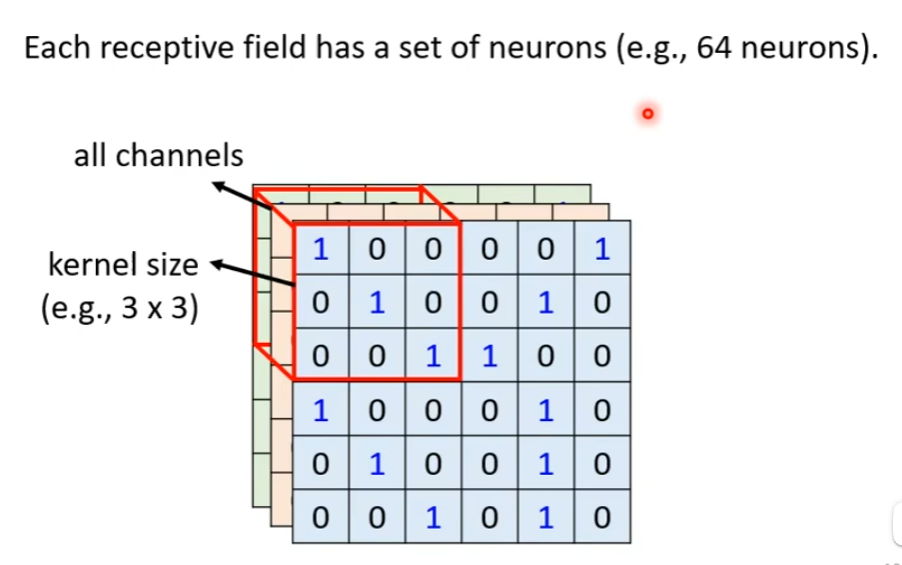

# 卷积神经网络CNN

我们开始探讨network的架构设计。

第一个要讲的network的架构变形是Convolutional Neural Network（CNN）。它是专门被用在影像上的。

希望通过CNN的例子，来了解network的架构设计有什么想法，为什么设计network的架构可以让我们的network的结果做的更好。

## 一、Image Classification

现在想象说，我们要做影像的分类。

也就是给机器一张图片，它要去决定说这张图片里面有什么样的东西。

在以下的讨论里面，我们都假设我们的模型输入的图片大小是固定的。（实际上，在如今的影像辨识任务中，往往都需要有这样的假设）

模型的输入是一张图片，模型的输出是$\hat y$，是一个vector。

假设图像是个猫，那么在向量中，决定cat的那一个dimension就是1，其他的都是0。

这个dimension的长度，就决定了你现在这个模型可以辨识出多少种类的东西。比如你的向量长度是2000，就代表说你这个模型可以辨识出2000种不同的东西。——如果你想让你的模型能识别上万种东西，那你的label的维度就应该是上万的。

模型实际的运行结果是一个$y'$，它和$\hat y$之间是有差距的（Cross entropy），这些都是之前讲过的理论。

---

接下来的问题是，怎么把一张影像当做一个模型的输入呢？

首先，对电脑来说，一张图片，其实是一个三维的Tensor（Tensor可以理解成矩阵）。——哪三维？高、宽、通道数。

> 什么叫通道（channels）？今天的图片，它的每一个像素都是由R、G、B三个颜色所组成的，三个channels就分别代表了R、G、B三种颜色。

接下来，我们就要把这个三维的Tensor给它拉直。把它拉直以后，就可以丢到一个network里面去了。

要理解一件事情：到目前为止，我们的network所接收的输入，其实就是一个向量。——所以，只要我们能够把一张图片变成一个向量，我们就可以把它当做是network的输入。

怎么把这个三维的Tensor变成一个向量呢？——最直接的办法，这个三维的Tensor里面有多少个数字呢？有`100 * 100 * 3`个数字。所以一张图片是由`100 * 100 * 3`个数字所组成的，把这些数字统统拿出来排成一排，就是一个巨大的向量。——这个向量就可以作为network的输入。

这个向量里面某一维存放的一个具体的数值，其实就是某一个像素的某一个颜色的强度。

---

总之，这个向量，我们把它作为network的输入。

我们目前为止，只讲过了Fully Connected Network。我们把这个向量当做这个network的输入。

那么input这边的feature vector的长度就是`100 * 100 * 3`。

那么，假设我们第一层的neuron的数目有1000个。——那么，你能计算一下，从input层到第一层之间，总共有多少个weight吗？

每一个neuron，它和输入向量的每一个数值之间都会有一个weight。所以，如果有`100*100*3`个输入数值，有`1000`个neuron，那么就会有`1000 * 100 * 100 * 3`个weight。也就是$3*10^7$个，是一个非常巨大的数目。

参数多，会有什么样的问题呢？

随着参数的增加，我们可以增加模型的弹性、能力……。但是，我们也增加了overfitting的风险。（从概念上来讲，模型的弹性越大，就越容易overfitting）

那么，我们在做影像辨识的时候，怎么避免使用这么多的参数呢？

考虑到影像辨识这件任务本身的特性，其实我们并不一定需要“Fully Connected”这件事。

考虑影像本身的特性，我们其实不需要每一个neuron跟input的每一个dimension都有一个weight。——怎么这样说呢？接下来，我们就对影像辨识这个问题，对影像本身的特性做一些观察。

### （一）Observation 1

第一个观察，是对影像辨识这个问题而言，假设我们想要知道“这张图片里面有一只动物”、“这个动物是一只鸟”，要怎么做呢？

也许对一个影像辨识的系统而言，对一个影像辨识的neuron，对一个影像辨识的类神经网络里面的神经元而言，它要做的就是侦测，侦测这张图片里面有没有出现一些特别重要的pattern，而这些pattern是代表了某种物件的。

举例来说，如果现在有某个neuron说，他看到鸟嘴这个pattern；有某个neuron又说，他看到眼睛这个pattern；有某个neuron说，他看到鸟爪这个pattern……。也许，看到这些pattern，综合起来就代表说我们看到了一只鸟。——类神经网络就可以告诉你说，因为看到了这些pattern，所以他看到了一只鸟。

也许你会觉得，看pattern，然后决定它是什么……这件事好像没有那么聪明。但仔细想想，人是不是也是用同样的方法来看一张图片中有没有一只鸟呢？

就算是人，在判断一个图片是什么物件的时候，往往也是抓最主要的特征，在看到这些特征以后，很直觉地就说，你看到了某种物件。——那么，对机器来说，也许这也是一个有效地判断影像中有什么物件的方法。

---

但是，假设我们现在要让neuron做的事情，是判断说现在有没有某种pattern出现，那也许我们并不需要每一个neuron都去看一张完整的图片。——因为这些重要的pattern，比如说眼睛、鸟嘴、鸟爪……并不需要看整张完整的图片才能够得到这些资讯。——比如判断有没有鸟嘴，只需要把红框那一部分图片给一个neuron看一下就行了，而不需要把整张图片都让他看。

所以，这些neuron也许根本就不需要把整张图片当做输入，他们只需要把图片的一小部分当做输入，就足以让他们侦测某些特别关键的pattern有没有出现。

上述是第一个观察。

### （二）Simplification 1

根据第一个观察，我们就可以做第一个简化。

怎么简化呢？本来我们每个neuron都要看完整的图片——把图片的每一个像素，以及每一个像素包含的三个通道，这些所有的资讯，都丢给一个neuron，最后让它产生output。——这是Fully Connected Network做的事情。

但是经过第一个观察，我们说，其实不需要让一个neuron看完整的图片，我们只需要让他看图片的一小部分就足够了。

那，怎么根据这个观察，来设计我们的neural network？

在CNN里面，有一个这样的做法：

我们会设计一个区域，叫做`receptive field`。每一个neuron都只关心自己的receptive field里面发生的事情就好了。

举例来说，这个蓝色的neuron，它的守备范围就是红色这块receptive field，大小为$3 * 3 * 3$个数字。

它怎么关心这个receptive field范围里的数字呢？它需要做的就是，先把这个receptive field中的数字拉直，变成一个长度为`3 * 3 * 3`，即27维的向量。

再把这个27维的向量作为这个neuron的输入，这个neuron会给27维向量的每一个dimension一个weight，最终再附带加上一个bias，即可输出，送往下一层neuron当做输入。

---

这个receptive field要怎么决定出来呢？——这个就要问你自己了。

你可以说：这边有一个蓝色的neuron，它是看左上角这个`3*3*3`的范围；这边有一个黄色的neuron，它是看右下角这个`3*3*3`的范围。

而receptive field彼此之间也可以是重叠的。

比如现在画一个receptive field在图上这个地方，它是绿色neuron的守备范围，且它跟蓝色的、黄色的都有一些重叠的空间。——这样也是可以的。

甚至图中同一块receptive field可以有多个不同的neuron来守备它。

---
此时可能你会有一些问题：

- 不同的neuron的守备范围，即不同的receptive field，可以有大有小吗？
>毕竟，有些pattern可能在一个很小的范围，也许是`3 * 3`的范围内，就可以被侦测出来。
>有的pattern可能要`11 * 11`的范围才能被侦测出来。

- 我的一个receptive field能否只考虑个别channel呢？
>上面的例子中，我们的每个receptive field，它都是对RGB三个channel都进行考虑。
>但也许有些pattern只在红色的channel出现呢？也许有些pattern只在蓝色的channel出现呢？
>我可不可以有些receptive field只考虑一个channel呢？
>答：可以。

- 上面例子中的receptive field都是正方形的，它可以是长方形的吗？
>答：完全可以。receptive field本来就是你自己定义的，你完全可以根据你对这个问题的理解决定你觉得receptive field应该要长什么样子。
>你可以再极端一点，你可以搞一个receptive field，它的范围是图片的左上角某块区域+右下角某块区域（即不相连的范围）。——理论上当然可以，只要你认为你需要这样处理。

#### Typical Setting

纵使receptive field有各种各样的定义方式，你可以随心所欲。但是，这里要讲一下最经典的receptive field的安排方式。

最经典的安排方式如下：

**1.会看所有的channel**

我们在做影像辨识的时候，通常不会认为某一个pattern只出现在某个channel里面，所以我们会考虑全部的channels。

**2.描述receptive field时，只需说明高和宽即可**

既然默认考虑所有channels，那么就不必再说明深度，只讲高和宽即可。而这个高和宽，合起来叫做“kernel size”。——一般这个kernel size不会设的太大，在影像辨识中，往往做个`3*3`的kernel size就足够了。如果你要设成`7*7`或`9*9`，其实就已经是偏大的了。

也许你会有个问题：既然设成`3*3`就能完成任务，好像有些奇怪。难道所有的pattern都能在`3*3`这么小的范围内就被侦测出来吗？明明有的pattern是很大的啊。（这个问题等会儿再说）

**3.同一个receptive field，一般会有一组neuron，同时去守备这个范围**

你画一个receptive field之后，不会只有一个neuron去关照它、去守备它，往往会有一组、一排neuron去守备它。比如说会有64个，或有128个neuron，去守备一个receptive field的范围。

**4.把左上角的这个receptive field往右移一点，就制造了一个新的receptive field**

这个移动的量叫做stride，在下图这个例子中，`stride = 2`。
stride是你自己决定的一个参数，一个hyperparameter，你要自己调的。
stride往往不会设太大，往往设1或2就可以了。因为你希望各个receptive field之间是有重叠的。
为什么你希望各个receptive field之间是有重叠的呢？——因为，假设各个receptive field完全没有重叠，那么假如有一个pattern就正好出现在两个receptive field的交界上面，那就没有任何neuron去侦测它了，那你可能就会miss掉这个pattern。——所以我们希望各个receptive field之间有高度的重叠。

但是，在上例中，对于第三个receptive field，出现了一个问题：它超出了影像的范围。

有人会说，超出范围了，那这块receptive field就不要了。但是问题是，图像的边缘部分也是我们必须要侦测的部分。但是确实超出范围了，怎么办？——补padding。

padding就是补值的意思。所以，当你的receptive field有一部分超出了影像范围了，那就当做超出部分里面的值都是0。——当然，也不一定必须补0，也可以补其他的值。比如，可以补这个receptive field的平均值吗？可以。可以补它相邻格子的值吗？可以。——有各种不同的padding方法。

除了横着移动，垂直方向上也会移动，并且垂直方向上stride同样也为2。

按照上述方式，扫过整张图片。所以，图片上每一个格子都是有被一个receptive field覆盖的，也就是每一个格子都有一群neuron在侦测那个地方有没有出现某些pattern。

上述内容，就是第一种简化“Fully Connected”的方式。

### （三）Observation 2

第二个观察是，同样的pattern，可能会出现在图片的不同区域里面。

比如“鸟嘴”这个pattern，它可能出现在图片的左上角，也可能出现在图片的中间。

但是，通过我们刚才的讨论，我们觉得，这似乎并不是什么太大的问题。因为对于一张图片而言，我们的receptive field是能够覆盖整个图片的各个角落的，所以，不管你的鸟嘴出现在图片的哪个位置，它肯定是在某一组neuron的守备范围内的。

比如，一张图片的鸟嘴是在左上角的，那么没关系，它肯定对应于左上角的一组neuron，而这一组neuron当中，如果有一个neuron是用来侦测鸟嘴的话，这个鸟嘴就会被侦测出来。

比如，一张图片的鸟嘴是在中间的，那么没关系，它肯定对应于中间的一组neuron，而这一组neuron当中，如果有一个neuron的用来侦测鸟嘴的话，这个鸟嘴就会被侦测出来。

现在的问题似乎出现了：“左上角的一组neuron中，某个侦测鸟嘴的neuron”与“中间的一组neuron中，某个侦测鸟嘴的neuron”，它们做的事情其实是一样的。只是它们的守备范围不一样。

那么，既然它们做的事情是一样的，只不过守备范围是不一样的。我们真的需要在每一个守备范围中都去放一个侦测鸟嘴的neuron吗？

### （四）Simplification 2

概括一下这个问题，就是，我们能不能让不同receptive field的neuron之间共享参数。

所谓的共享参数，就是说这两个neuron的各个参数是完全一样的。

在上图中，对两个neuron的weight用相同颜色的线，来表示它们的weight的确是相等的。

那有人会问：它们的weight全都一模一样，那会不会输出也一模一样？不会。因为它们对应的是不同的守备范围，所以它们的输入肯定是不一样的，那么输出自然也是不一样的。

因此，对于同一个守备范围下，对应的不同neuron，我们就不要去做参数共享了，因为如果做了共享，那么它们的输入一样、参数一样，输出就完全一模一样了。

上述内容，是我们做的第二个简化。我们让一些neuron之间可以共享参数。至于要怎么共享，理论上来说完全可以由你自己决定。

#### Typical Setting

在影像辨识上，常见的共享方法是怎么设定的。

之前说到，每一个receptive field，它都有一组neuron在负责守备，比如说有64个neuron。

具体来说，如图，左上这个receptive field有64个neuron，右下这个receptive field也有64个neuron。

它们彼此之间怎么共享参数呢？（图中我们用一样的颜色代表两个neuron共享一样的参数）

左边的第一个neuron，和右边的第一个neuron共用参数；左边的第二个neuron，和右边的第二个neuron共用参数，左边的第三个neuron，和右边的第三个neuron共用参数……

每一个receptive field都只有一组参数，这些参数有一个名字叫做filter。所以，这两个neuron共用同一组参数，这组参数就叫做filter 1；另外两个neuron共用的一组参数就叫做filter 2，……

### （五）总结Benefit of Convolutional Layer

**Fully Connected Layer**

它是弹性最大的。

但是我们说，也许不需要看整张图片，也许只要看图片的一小部分，就可以侦测出重要的pattern，所以我们有了receptive field的概念。

**Receptive Field**

当我们强制一个（一组）neuron只能看图片中某一个范围的时候，它的弹性是变小的。

**Parameter Sharing**

接下来，我们还有参数共享这件事。参数共享这件事又更进一步限制了network的弹性。
本来在Learning的时候，它可以决定说，每一个neuron可以有各自不同的参数，它们可以正好学出一模一样的参数，也可以有不一样的参数。
但是加入参数共享以后，就意味着，某一些neuron无论如何，参数就是一模一样的，没得选。这就更增加了对neuron的限制。

**Convolutional Layer**

Receptive Field，加上Parameter Sharing，就是Convolutional Layer。

有用Convolutional Layer的Network，就叫“Convolutional Neural Network”。

## 二、另一种介绍CNN的方式

### （一）Convolutional Layer

Convolutional Layer就是里面有很多的Filter。这些Filter，它们的大小是`3*3*channels`。（如果是彩色图片，就是channels = 3，如果是黑白图片，就是channels = 1）

总之，每一个Filter就是一个Tensor，大小是`3*3*channels`。

而每一个Filter的作用，就是要去图片里面抓取某个pattern。（当然，这个pattern得是在`3*3`的范围内，才能被filter抓出来了）

那么，对于某一个Filter，它是怎么去图片里面把pattern抓出来的呢？

此处，我们为了方便介绍，我们的图片认为是黑白的图片，即channels为1。

我们先不考虑Filter中的参数是怎么训练的，我们先认为Filter中的数值是已知的，是训练好的。但实际上这些Filter里的参数是未知的，是要通过Gradient Descent去找出来的。总之，我们在此处假设这些参数已经找出来过了。

我们现在重点是想看看，一个已经找好的Filter，它是怎样在图片上面进行运作，从而把pattern侦测出来的。

拿Filter对原图片进行步长为1的卷积操作，得到一系列结果。

我们现在的问题是，做这些运算，得到一堆数字，有什么用？为什么就能侦测pattern了？

注意，观察这个Filter，可以发现它的特点是“对角线的地方都是1，其他地方都是-1”，这就会导致一个效果，即，它在扫描原图的过程中，如果原图片出现“对角线的地方都是1，其他地方都是0”的时候，卷积的结果最大。

所以，根据卷积的结果来看，我们就知道，这张图片左上角和左下角的地方，出现了这种pattern，即“对角线是三个1，其他地方均为0”的pattern。

对于Filter 2来说，它的特点可能是“中间竖着的部分全是1”，同样拿它把原图扫描一遍，得到一系列结果。

### （二）Multiple Convolutional Layers

总之，这样的操作做下来，每一个Filter会带给我们一群数字。

那么，如果有64个Filter，我们就得到64群数字。——这群数字，它又有个名字，叫做**Feature Map**。

所以，当我们拿一张图片，经过一个Convolutional Layer，且这个Convolutional Layer里面有64个Filter，我们就产生出来一个Feature Map，这个Feature Map里面就有64组数字。并且，在这个例子当中，Feature Map中的每一组数字都是`4*4`的大小。

这个Feature Map可以看作一张图片，只不过这个图片的channels不是RGB，而是有64个channels，且每一个channel对应一个Filter。

即，本来的一张原图片，有三个channels，它通过一个Convolutional Layer，变成了一张新的图片，有64个channels。

当然，这个“Convolutional Layer”是可以叠很多层的。

那如果来到第二层Convolutional Layer，会发生什么事呢？

对于第二层的Convolutional Layer，它其中也有一堆的Filter。对于每一个Filter而言，它的宽高设成`3*3`，而它的深度，必须设为64。因为Filter的深度就对应于它要处理的图片的channels。

总结一下就是，对于第一层Layer而言，它的输入是原图片，若原图片是黑白，则Filter的channels为1即可；若原图片是彩色，则Filter的channels为3即可。

对于第二层Layer而言，它的输入是上一层Layer的输出，而上一层的输出可以视为一个channels为64的图片，所以该层的Filter的channels也要为64才可以。

### （三）Filter的大小设为3×3会不会导致看不到比较大范围的pattern

其实是不会的，完全没有影响。为什么呢？

拿前两层的Convolutional Layer举例，如下图所示：

对于第二层Convolutional Layer，它是在第一层Convolutional Layer输出结果的基础上继续用Filter去做卷积操作的。

此时，如果Filter的大小依然选取为`3*3`，你会发现，虽然它表面上来看是宽3、高3，但实际上，它里面的每一个数字，背后对应的是第一层Convolutional Layer所处理数据中的一个`3*3`范围数据的，也就是原图片中的一个`3*3`范围。

所以，当我们看到第一层Convolutional Layer输出出来的Feature Map的`3*3`范围的时候，我们其实是相当于在原图像上考虑了一个`5*5`的范围。

所以，随着你的Network叠的越来越深，虽然是同样`3*3`大小的Filter，但它实际在原图像上看的范围是越来越大的。——所以，Network够深，你就不用怕你侦测不到比较大的pattern。

## 三、对比两种介绍过程

我们上面大标题一、大标题二，分别用两种方式讲了CNN。

但是这两个介绍方式，本质上是一样的。

在“故事一”中讲到，有一些neuron会共用参数，这些共用的参数，就是“故事二”里面的Filter。——我们“故事一”中提到的参数是一个很长的向量（如`3*3*3`长度的），它就对应于“故事二”中Filter的尺寸（如`3*3*3`的Tensor）。

（注意上图的一个细节，向量连接的weight箭头是不同颜色的，它对应于Filter的Tensor中对应颜色圈出来的数据）

在故事一中，我们说到，不同的neuron之间会share它们的weight参数，并守备不同的范围。——什么叫共享weight参数，就是使用同一个Filter呗。——什么叫守备不同的范围，就是拿着Filter去扫描这个范围内的图片呗。

## 四、补充

### （一）Observation 3

Convolutional Layer在做影像辨识的时候，其实还有第三个常用的东西。——pooling。

pooling是怎么来的呢？

我们把一张比较大的图片做subsampling，举例来说，你把偶数的column都拿掉，奇数的row都拿掉，图片变为原来的1/4，但是不会影响图片呈现的内容。把大的图片缩小，但缩小后的图片仍然看起来和原始图片没什么不同。

#### Pooling —— Max Pooling

pooling是怎么运作的呢？

pooling本身没有参数，不是一个Layer，里面没有weight，没有要learn的东西。——所以有人会说pooling比较像一个activation function（比如Sigmoid、ReLU那些），因为它没有要learn的东西，它只是一个operator，它的行为都是固定好的，没有说要根据data学任何东西。

pooling其实也有很多种版本，此处讲的是Max Pooling。

Max Pooling是怎么运作的呢？

我们刚才说，每一个Filter都产生一把数字，每一个Filter都产生一把数字。

要做pooling的时候，我们就把这些数字，几个几个一组。比如在这个例子里面，就是`2*2`的为一组。

在Max Pooling里面，我们选的代表，就是每组中最大的那一个。

问：为什么要选最大的那一个？

答：pooling方法并不是必须要选最大的那一个，只不过Max Pooling这个方法，它的规定就是要选最大的那一个。当然也有其他的pooling方法，比如mean pooling就是选平均。

问：一定要`2*2`为一组吗？

答：也不一定。这个是你自己决定的。

---

我们做完Convolution之后，往往还会搭配pooling。

pooling做的事情，就是把图片变小。

Convolution以后，我们会得到一张图片；做完pooling以后，我们就是把这张图片的channels不变，但是我们会把图片变得比较小一点。

在上面的例子里面，本来是64个channels的图片，经过pooling以后还是64个channels。但是，本来是`4*4`的图片，我们以`2*2`为一组，pooling之后就会变成`2*2`的图片。

而在实际应用中，我们往往就是Convolution和pooling交替使用。注意：也可能是“做好几次Convolution，做一次pooling”，而并不是必须要“做一次Convolution就做一次pooling”。

不过，你可以想象出，做pooling其实对你的performance还是可能会带来一点伤害。比如你做的东西是一个非常细微的东西，那么你随便做subsampling的话，performance就会差一点。——所以近年来，你会发现很多做影像辨识的Network的设计，往往开始把pooling丢掉。他会去做“Full Convolution”的Network，也就是整个Network里面统统都是Convolution，完全都不用pooling。——这是因为近年来，运算能力越来越强，而pooling最主要的使用理由就是为了减少运算量，做subsampling，把影像变小，减少运算量。那如果今天你的运算资源足够支撑你不做pooling的话，很多Network的架构就不做pooling，全Convolution，然后看看能不能做得起来、能不能做得更好。

### （二）The Whole CNN

至此，我们知道了，一般来说我们的架构就是Convolution，加pooling。（刚才也讲了，pooling也是可有可无了，今天很多人可能会选择不用pooling）

总之，如果你把这些Convolution或pooling经过了若干次，最终做完之后，接下来呢？怎么得到最终的结果呢？

你会把最后一层得到的output，做一个Flatten。

Flatten的意思就是，把这个影像里面，本来排成矩阵样子的东西，把它拉直。把所有的数值拉直，变成一个向量。

再把这个向量丢进“Fully Connected Layers”里面。

最终你可能还要再过一个softmax，最终得到辨识的结构。

这就是一个经典的影像辨识的Network，可能有的样子。——里面有Convolution，有pooling，有flatten，最后再通过几个Fully Connected Layer，过softmax，最终得到辨识结果。

## 五、Application：Playing Go

除了影像辨识以外，你可能听过CNN另外一个最常见的、最耳熟能详的应用就是用来下围棋。

我们说下围棋就是一个分类的问题，你的Network的输入，是棋盘上黑子和白子的位置，你的Network的输出，就是下一步应该要落子的位置。

我们现在已经知道，Network的输入必须是一个向量。那怎么把棋盘表示成一个向量呢？

完全没有问题。棋盘上有`19*19`个位置，我们就把棋盘表示成一个`19*19`维向量。对于棋盘上某一个位置，如果有一个黑子，就填1；如果有一个白子，就填-1；如果没有子，就填0。用这个方法，我们就可以告诉Network现在棋盘上的盘式是什么样子。即，我们可以用一个`19*19`的向量来表示当前棋盘的盘式。

把向量输入到Network里面，就可以把下围棋这个分类问题，让这个Network去进行预测，得出下一步应该落子在哪个位置最好。

所以下围棋，就是一个有`19*19`个类别的分类的问题，output就是说在这`19*19`个类别里面，哪一个类别是最好的，应该要选择下一步落子的位置在哪里。

这个问题完全可以用一个Fully Connected Network来解决，但是用CNN的效果更好。

为什么用CNN的效果更好呢？

首先，你完全可以把一个棋盘看做是一张图片，看作一个解析度为`19*19`的图片。对于每一个pixel（像素点），都代表一处落子的位置。

那么，每一个pixel，它的channels是多少呢？

在AlphaGo的原始论文里面，它告诉你说，每一个棋盘上的pixel，它是用48个channel来描述的。也就是说棋盘上的每一个位置，它都用48个数字来描述。——至于为什么是48个，这是围棋高手已经考虑好、精心设计出来的。比如说这个位置旁边是不是有颜色不一样的、……等等。这样去描述每一个位置，总共要用48个数字来描述棋盘上的每一个位置。

总之，这个棋盘就是一个解析度`19*19`的图片，它的channels是48。

### （一）Why CNN for Go Playing？

但是为什么CNN可以用在下围棋上呢？

我们刚才强调说，CNN并不是你随便用，都能得到好的效果的。它是为影像设计的。所以，如果一个问题它跟影像没有什么共同特性的话，你其实不该用CNN。

今天竟然在下围棋上可以用CNN，那意味着什么。意味着围棋跟影像有共同的特性。

什么样共同的特性呢？

**1.Some patterns are much smaller than the whole image.**

我们刚才说影像上的第一个观察是很多重要的pattern你只需要看小范围就知道了。

下围棋也是一样的。

例如上图，你不用看整个棋盘，你只需要看这一处pattern，你就能够知道发生了什么事。

在AlphaGo中，它第一层的Layer当中，Filter的大小设计的就是`5*5`。——这说明，显然在设计这个Network的人，他觉得棋盘上很多重要的pattern也许看`5*5`的范围就可以知道了。

**2.The same patterns appear in different regions.**

我们在影像上的第二个观察是，同样的pattern可能会出现在不同的位置。

在下围棋里面显然也是一样的。

所以，从上面两个观点来看，影像和下围棋有很多共同之处。

---

**3.Subsampling the pixels will not change the object.**

但是让人想不透的是，在做影像的时候，我们会去做pooling。也就是说，对于一张影像，我们做subsampling之后，并不会影响我们对影像中物件的判读。

但是棋盘是这个样子吗？

你可以把棋盘上的奇数行和偶数列拿掉，还是同一个棋局吗？——听起来好像不是。下围棋这么精细的任务，你随便拿掉一行、一列，那整个局势就不一样了。

所以这个问题似乎让人有些困扰。

在读了一下AlphaGo的论文之后，它有添加padding，有用Filter，有设置kernel size，有设置stride……，但读下来会发现，它压根就并没有用pooling。

这给了我们一个很好的例子，就是说，类神经网络的应用之道，存乎一心。你不要看影像上面都有用pooling，就觉得pooling就是好的，你就也用pooling。实际上在下围棋的时候就是不适合用pooling。

所以，你要想清楚，你今天有个Network架构的时候，这个Network架构到底代表什么意思？它适不适合用在我现在这个任务上？

### （二）More Applications

CNN除了可以应用在下围棋上面。近年来也用在语音上、文字处理上。这里就不再细讲。

但是，如果你真的想把CNN用在语音上，用在文字处理上，你要仔细看一下文献上的方法。看看它在语音上、文字处理上，它的Receptive Filed的设计、参数共享的设计，跟影像上是不一样的。所以你要想清楚那些，它跟影像是不一样的，而是考虑了语音跟文字的特性以后所设计的。所以你不要以为在影像上的CNN直接套到语音上就可以Work。

## 六、To learning more ...

**CNN is not invariant to scaling and rotation (we need data augmentation).**

有人会说，CNN其实没有办法处理影像放大缩小，或者是旋转的问题。

假设今天你给CNN看的狗都是这个大小：

它可以辨识说这是一只狗。

当你把这个图片放大的时候：

它可能就不能辨识出这个还是一只狗了。

你可能会奇怪，怎么一放大就不行了？狗的形状、样子不是一模一样的，没有变化吗？

你要知道，对于CNN来说，虽然两张图片中的狗的形状、样子是一模一样的，但是如果把图片拉长成向量的话，它里面的数值就是完全不一样的。

所以，这两张图片虽然对于人眼来说一模一样，但是对于CNN的Network来说，它俩是非常不一样、毫不相关的两张图片。

所以事实上，CNN并不能处理影像放大缩小或者是旋转的问题。当它今天在某种大小的影像上（比如上面两张“狗”图片中的第一张，也就是比较小的那张）学会做影像辨识了。之后你把照片放大，再让它辨识，它就会辨识不出来。

所以CNN并没有你想象的那么强。所以这也就是为什么在做影像辨识的时候，往往都要做data augmentation。

所谓data augmentation的意思就是，你把你的训练资料，每张图片都从里面截一小块出来放大——让CNN看过不同大小的pattern；然后把图片旋转，让它看过某一个部件旋转以后长什么样子。CNN才会做到好的结果。

或者你说：既然CNN不能够处理放大缩小、旋转的图像辨识问题，那么有没有一个其他的Network架构，是可以处理这个问题的呢？

其实是有的，有一个架构叫Spatial Transformer Layer。（这里不讲，放个链接，想看可以看）

