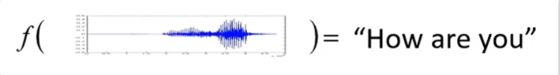
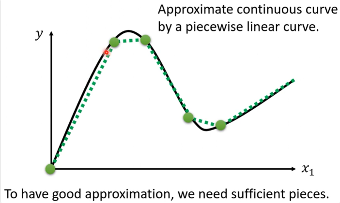
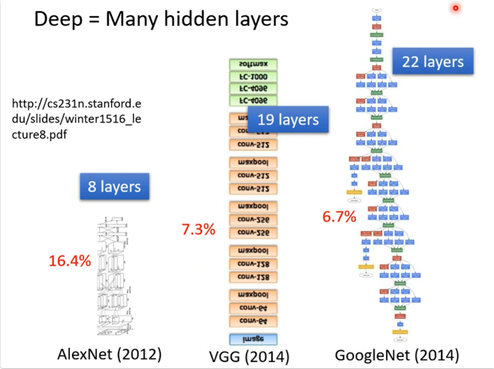
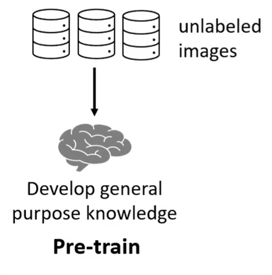
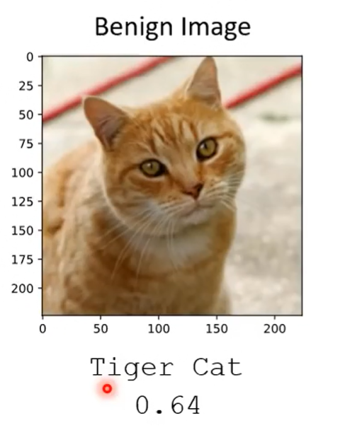

# 机器学习和深度学习基本概念、反向传播、梯度下降

## 一、什么是机器学习

可以用一句话来描述机器学习这件事：Looking for function。机器学习就是让机器帮我们找到一个函数。

### （一）举例

- Speech Recognition
    

比如语音识别，输入是一段声音讯号，输出是一段对应文字。那关键就在于从“声音讯号”到“对应文字”之间的映射函数。

这是一个非常巨大的工程，这个函数显然非常复杂，不是人类可以写出来的函数。我们期待通过机器的力量，把这个函数找出来，这就是机器学习。

- Image Recognition
    

比如图像识别，同理。

- Playing Go
    

总之，机器学习，就是让机器帮我们找到一个人类写不出来的复杂函数。

### （二）不同类型的函数

- Regression：The function outputs a scalar.
    

假设今天我们要找的函数，它的输出是一个数值，这样的机器学习任务，我们称之为regression。

比如，预测明天中午PM2.5浓度的任务。它的输入有“今天的PM2.5浓度”、“今天的温度”、“今天的臭氧”等，经过一个“f”函数，得到“明天中午PM2.5浓度”的一个数值。这样的任务叫做regression。

- Classification：Given options (classes), the function outputs the correct one.
    

classification这种任务，让机器做的是选择题。我们先准备好一些选项，这些选项又叫做“类别”。函数的输出就是从我们设定好的选项里面选择一个，当做输出。这个任务就叫做classification。

比如，判断一个邮件是不是垃圾邮件。这个函数的输入是“一封电子邮件”，输出是“是垃圾邮件”或“不是垃圾邮件”。机器要从这两个选项里面选一个出来。（注意，选项可以不止有两个，也可以有多个选项）

AlphaGo本身也是一个Classification的问题。只是这个Classification它的选项是比较多的。比如你想让AlphaGo学会下围棋，那么你要给它提供多少个选项呢？——你就想想看，棋盘上有多少个位置。有`19*19`个位置。那么，让机器下围棋这件事情，其实就是一个“有`19*19`个选项的选择题”。你要叫机器做的就是找一个函数，这个函数的输入是“棋盘上黑字和白字的位置”，输出就是从`19*19`个选项里面选出一个正确的选项，从`19*19`个可能的落子位置里面选出下一步应该要落子的问题。

- Structured Learning：create something with structure (image, document).
    

在Regression，Classification以外，还有一个大家往往害怕碰触的问题，叫做“Structured Learning”。就是，今天机器不只是要做选择题、不只是输出一个数字，还要产生一个有结构的物件。举例来说，机器画一张图、写一篇文章。这种叫机器产生一个有结构的东西的问题，就叫做“Structured Learning”。

如果说的形象一点，我们可以这样说：我们就是要机器学会“创造”这件事情。

### （三）机器是怎么找这个函数的

举一个以YouTube作者的频道后台订阅数据，来预测明天他的频道的点阅人数的例子。

我们想找的函数，它的输入就是“该作者的作品后台数据”，它的输出就是“明天的点阅人数”。

那接下来，我们就要问：怎么找出这个函数`f()`呢？

机器学习找这个函数的过程，可以分成三个步骤：

#### （1）Function with Unknown Parameters

第一步，我们要写出一个带有未知参数的函数。简单来说就是，我们先猜测一下，我们打算找的这个函数f，它的数学式到底长什么样。

举例来说，我们此处先做一个最初步的猜测：$y=b+wx_1$。

这里的y是明天（2月26日）的点阅数，x1是今天（2月25日）的点阅数。b和w是未知的参数。

x1是已知的资料，y是要预测的资料，未知参数w和b是准备要透过资料来找出的，我们还不知道w和b应该是多少。

我们只是隐约的进行这样的一种猜测，那么为什么会有这样的猜测呢？这个猜测往往就来自于你对这个问题本质上的了解，也就是`domain knowledge`。domain knowledge往往也就用于你写这个带有未知数的函数的时候。——我们为什么知道明天的点阅人数就是今天的点阅人数乘上w，再加b呢？——我们其实不知道，这是一个猜测。（因为我们心里面觉得，明天的点阅人数，也许和今天的点阅人数有点关联吧，所以我们给今天的点阅人数乘上w，再加上b作修正） 这只是个猜测，它也不一定对。我们等会儿回头会再来修正这个猜测。

这个“Parameter”翻译过来就叫做“参数”；这个“Function”，我们也就叫做“Model”，我们也常常听到有人说“模型”这个东西。Model这个东西在机器学习里面，就是一个“带有未知Parameter的Function”。这个$x_1$是我们已经知道的东西，这种东西叫做“Feature”。w和b，我们也给它一个名字，这个跟Feature相乘的，叫做“weight”，这个没有和Feature相乘，只是加在后面的，叫做“bias”。

#### （2）Define Loss from Training Data

第二步，我们要定义一个东西，它叫“Loss”。

Loss是什么东西呢？Loss也是一个Function，这个Function里面的参数，就是Model里面的参数（刚才我们的Model已经写出来了，我们的Model叫做$y=b+wx_1$，而b和w是未知的，是我们准备个要找出来的），那么这个所谓的L，所谓的Loss，这个Function的输入就是b和w，即$L(b,w)$。

那Loss这个Function的输出的值代表什么呢？代表说，现在如果我们把这一组未知参数设定为某一组数值的时候，这一组数值是好还是不好。

这样讲可能有点抽象，我们举一个具体例子。

比如我们就让b=0.5k，让w=1。也就是说，这个Model是$y=0.5k+1x_1$。我们现在的问题是：这个函数好还是不好？

如何检验这个函数好还是不好，这个我们就要从训练资料中来进行计算了。——我们的训练资料是什么呢？我们的训练资料是这个频道过去的点阅次数。比如从2017年到2020年，每天的这个频道的点阅次数。

接下来我们就可以计算Loss。怎么计算呢？

我们把2017年1月1日的点阅次数，代入到这个函数里面（即$0.5k+1x_1=y$里面），注意，不要忘了我们的目标，我们是要看看“当b设定为0.5k，w设定为1的时候，这个函数到底有多棒”。此处的x_1是这一天的点阅次数，也就是此处的$4.8k$。——总之，根据这个函数，我们预测出的第二天的点阅次数应该是$0.5k+4.8k*1=5.3k$。

上述是我们根据函数得到的第二天点阅次数的预测值。而2017年1月2日的实际点阅次数我们也是知道的，从后台数据里面即可得知，是4.9k。——因此，我们可以比对一下，这个函数预测的结果，跟真正的结果，它的差距有多大。

函数的预测值是$y=5.3k$，而频道的真实点阅数是$\hat{y}=4.9k$，可见，这个函数高估了第二天的点阅数。至此，我们也就可以计算一下其中的差距。（注意，估测的值用y来表示，真实的值用\hat y表示，这个真实的值也叫**Label**）我们这里计算差距的方式，就是把预测值与真实值直接做减法并取绝对值，（当然，计算差距的方式也不止这一种）即$e_1=|y-\hat y|=0.4k$。

我们所拥有的资料，也并不是只有2017年1月1日，和1月2日的资料。我们拥有2017年1月1日，到2020年12月31日所有的资料。因此，我们也可以继续用1月2日的值去预测1月3日的值。同样的方法，就可以算一下这三年以来，每一天的预测的误差。

接下来，我们就把每一天的误差统统加起来，然后取一个平均值，公式如下：

$$  
Loss:\quad L=\frac{1}{N}\sum_n e_n  
$$
 
公式中的N就代表我们训练资料的个数（我们的资料是三年来每天的资料，也就是`365*3`个了），$e_n$是第n天的误差值。

总之，我们计算出一个值L，表示Loss。那么，这个L的值越大，就代表我们现在这一组参数越不好；这个L越小，就代表我们现在这一组参数越好。

对于误差e的计算，有多种方法。刚才我们使用的是$e=|y-\hat y|$这种方法，这种方法叫做`mean absolute error`，MAE。

如果你的e是用这种方法计算的，即：$e=(y-\hat y)^2$来计算的，那这种方法叫做`mean square error`，MSE。

MSE和MAE其实还是有一些细微的差别的，通常你要选择用哪一种方法来衡量差距，那就看你的需求，看你对这个任务的理解了。这里就不细说了。

而当有些任务，它的y和\hat y都是概率的话，这时你可能会选择`Cross-entropy`。（不过这些问题我们之后都会再说）

我们可以调整不同的w，调整不同的b，穷举各种w，穷举各种b，组合起来。

我们可以为不同w和b的组合，都去计算它的Loss。然后就可以画出以下这一个等高线图。在这个等高线图当中，越偏红色系，代表计算出来的Loss越大（代表这一组w和b越差）；越偏蓝色系，代表计算出来的Loss越小（代表这一组w和b越好）。

像这种等高线图。即，你根据不同的参数，计算出它的Loss，并画出的等高线图，叫做`Error Surface`。

#### （3）Optimization

第三步要做的事情，其实是解一个最优化的问题。

我们今天要做的事情，就是找一个w和b，把未知的参数找一组数值出来，看代哪一组数值进去，可以让我们的Loss的值最小，那就是我们要找的w和b。最好的一组w和b，我们把它们记为$w^*和b^*$。$w^*, b^*=arg\min_{w,b}L$。

这个东西要怎么做呢？我们会用到的Optimization的方法，叫做`Gradient Descent`。

这个Gradient Descent是怎么做的呢？

首先，为了简化起见，我们假设我们未知的参数只有一个，是w。（注意，并不是说Gradient Descent一上来要先把其他参数忽视掉、只处理一个参数，而是我们此处为了讲解简便，为了更好理解和接受，我们自己把这个函数视为单参数了。实际的Gradient Descent方法，它是几个参数就是几个参数，就去处理几个参数）

那么，当我们的w代入不同数值的时候，我们就会得到不同的Loss，下图中这条曲线，就是Error Surface（和上文中的等高线图那里的Error Surface是一样的道理，只不过上面那里是二维的，因为它有两个参数；而此处我们先认为只有w一个参数，所以是一维的，但它仍旧也是Error Surface）。

现在的问题是：怎样找到一个w，使得Loss最小？

我们的做法是：

首先，要随机选取一个初始的点，这个初始的点，我们叫做$w^0$。（此处我们讲的“随机”，真的就是随便选一个。可能在有的网络中，它的$w^0$的选法会尽量去选择一个好的，但是此处我们不讲这回事）

接下来，要去计算出，在$w=w^0$的时候，在这一点处，Loss对w的微分是多少。即：计算出

$$  
\frac{\partial L}{\partial w}|_{w=w^0}  
$$

  

或者直观的理解为，就是计算出在$w^0$这一点处，Error Surface的切线斜率，也就是上图中蓝色虚线的斜率。

那么，如果这条蓝色虚线的斜率是负的，它表示什么意思呢？——就代表：左边比较高，右边比较低。——那么，如果左边比较高、右边比较低的话，我们要做什么样的事情呢？——那我们就把w的值取大一点，就可以让Loss变小。

如果这条斜率是正的，那就代表：左边比较低，右边比较高。——那我们就把w的值取小一点，就可以让Loss变小。

总之，计算偏微分的目的就是为了看看哪边比较高、哪边比较低，从而往使得Loss变小的方向去调整参数。

对于这种情况，我们显然是要把w往大了去调整（往右跨一步）。但是又有一个问题：把w加大多少呢？（这一步应该跨多大呢？）

这个“跨步”的大小，取决于两件事：

第一件事是，在$w^0$这一点处的斜率有多大。这个地方的斜率越大，那跨步自然就要大一点。斜率小，步伐就跨的小一点。

第二件事是，除了斜率（微分）以外，我们还有一个$\eta$会影响步伐大小。这个$\eta$叫做==**learning rate**==（学习速率）。这个learning rate，它是怎么来的呢？是你自己设定的，你自己决定这个$\eta$的大小。如果你$\eta$设大一点，那么每次参数的调整步伐就会比较大，学习可能就比较快；如果设小一点，参数的更新就会比较慢，每次只变化一点点。——这种，你在机器学习过程中需要自己去设定的东西，就叫做==**hyperparameters**==。

总之，我们把$w^0$往右移动一步，这个新的位置，就叫做$w^1$。这个移动的步伐长度，就是$\eta \frac{\partial L}{\partial w}|_{w=w^0}$的大小。或者直接这样说：$w^1 = w^0 - \eta \frac{\partial L}{\partial w}|_{w=w^0}$。（注意，这里为什么是w0减去后面这个东西，而不是加上？——是因为这里这个偏微分的值是负的）

接下来，反复进行上述操作，不断地更新w的值，最后会停下来。

什么时候会停下来呢？有两种情况：

第一种情况，你失去耐心了。比如你今天就打算说，我今天最多调整我的参数100万次，我的上限次数就这么多。参数更新这么多次以后，我就不再更新了。你如果有耐心等到下一周出结果，那你就把上限设的多一些；如果你只想今天得到一个结果，那你就把上限设的少一些。

第二种情况，是一种理想上的停下来的情况。当我们不断调整一个参数，调整到一个地方，它的微分的值计算出来刚好是0。由于$\eta \frac{\partial L}{\partial w}|_{w=w^0} = 0$，所以你的参数就不会再移动位置了，也就停下来了。

讲到这个地方，你会发现这个Gradient Descent它有一个巨大的问题。这个巨大的问题，在这个图中非常容易能被看出来，那就是，我们没有真正找到那个可以让Loss最小的那个w。

其实让Loss最小的那个w，还要在$w^T$往右一段距离的那个地方。但是实际上，按照刚才的描述，我们w的调整，它到达$w^T$就停住了，就没有办法再移动w的位置。

那这个“真的可以让Loss最小的地方”，叫做gloabal minima。而像$w^T$这个地方，它叫做local minima。（极小值和最小值的区别）

有很多人会说，Gradient Descent有这个问题，有local minima的问题，它不好。但实际上来讲，Gradient Descent的local minima的问题并不是一个真正带来很大影响的问题。它的真正痛点并不在于local minima的问题上，而在其他地方。这个我们以后再讲。

刚才我们为了讲解方便，我们把它简化成了只有一个参数的问题。现在我们真正去考虑这个与w和b这两个参数同时相关的Loss的Gradient Descent问题。

那么，有两个参数的情况下，怎么用Gradient Descent呢？和一个参数的情况其实没什么本质区别。如果一个参数的情况你理解的比较好了，那么你很快也就可以推广到两个参数的情况。

首先，给两个参数以随机的初始值，即$w^0$和$b^0$。

接下来，计算w对L的微分，以及b对Loss的微分，在$(w=w^0,b=b^0)$处的微分值。即：

$$  
\frac{\partial L}{\partial w}|_{w=w^0,b=b^0}\\ \frac{\partial L}{\partial b}|_{w=w^0,b=b^0}  
$$

  
计算好微分以后，就根据刚才“一个参数”情况下的做法，去更新w和b。根据微分值来决定更新的方向，根据微分值与学习速率来决定移动的步长。即：

$$  
w^1 = w^0- \eta \frac{\partial L}{\partial w}|_{w=w^0,b=b^0}\\ b^1 = b^0- \eta \frac{\partial L}{\partial b}|_{w=w^0,b=b^0}\\  
$$

  
在此处，可能有人会问：这个微分不会算，怎么办？——微分不会算也不用紧张，因为在Deep Learning的框架里面，比如在PyTorch里面，这个微分都是程序自动帮你计算的，你只需要写一行代码即可，自动就给你把微分的值算出来了。你就算完全不知道微分是怎么一回事，你也还是可以把微分的值算出来。

最后，就是反复执行上述步骤，不断更新w和b，期待最后可以找到一个最好的w和b，即$w^*,b^*$。

就像上面一维曲线图那样，直观地展示w的更新方向及步长，此处我们也可以画一个二维的w和b的更新过程图，如下：

#### （4）思考一些问题

上述我们说了机器学习的三个步骤。先规定一个含有未知参数的函数，然后定义一个Loss函数，最后不断的进行参数调优。

看似挺不错，我们得到了一个最佳的w和b，并且令平均Loss很小，只有0.48k。——但是，这就是一个令人满意的结果了吗？

也许不是。为什么？

因为这三个步骤合起来，叫做“训练”。而我们现在是在“我们已经知道答案的资料上”，即“2017-2020年每天的点阅数”去计算Loss。——我们其实只是在“自嗨”而已，也就是说，我们只不过是“假装我们不知道第二天的点阅数”，然后拿这个函数去进行预测，并发现最小误差是$0.48k$。

但是，我们真正在意的，是“已经知道的点阅数”吗？

不是。我们真正要在意的，是我们不知道的、未来的观看次数是多少。

所以，我们接下来要做的事情是什么呢，就是拿这个函数来真正的预测一下未来的点阅数。

我们上述“已知资料”是到2020年12月31日截止的。那么，我们从最后一天开始，即2020年的最后一天，之后我们每一天都拿这个函数，去预测下一天的点阅数。例如，我们就拿2020年12月31日的点阅数，去预测2021年1月1日的点阅数；我们就拿2021年1月1日的点阅数，去预测2021年1月2日的点阅数……。每天都做这件事，一直做到2021年2月14日。然后得到一个平均的误差值，看看是多少。——这个是真实的数据的结果。它计算出来的误差值是$L'=0.58k$。（此处的Loss我们用$L'$来表示）

可见，在“已经看过的资料上”，也就是“训练资料”上，它的误差值是相对比较小的；而在“没有看过的资料上”，它的误差值是相对比较大的。

能不能做得更好呢？

在做得更好之前，我们先来分析一下结果。

这个图怎么看呢？这个图的横轴代表的是时间，纵轴代表点阅数。红色的线是“真实的点阅数”，蓝色的线是“机器预测的点阅数”。可以发现，蓝色的线几乎就是红色的线往右平移一天（不过不完全是），道理也很简单，因为函数是$y=0.1k+0.97x_1$，它基本上是拿前一天的观看数加上100就得到了第二天的观看数，所以几乎是直接拿前一天的观看数来当做下一天的观看数了。所以看上去几乎就是这样。

对于这段曲线，我们还发现一个现象：周五、周六的观看数特别少。而且这个现象每隔7天就是一个循环。既然我们知道了“每隔7天就是一个循环”，那么我们原先的Model，即$y=0.1k+0.97x_1$就显得很烂，因为它只是用前一天来预测后一天。既然每7天是一个循环，那么如果我们的一个模型它能够“参考前7天的资料”来预测“接下来7天的结果”，也许说不定会预测的更准。

所以我们就要修改一下我们的模型。——我们为什么此处要进行模型的修改。就是因为，我们对这个问题的理解又变化了。即，模型的修改，往往来自于你对于这个问题的理解。也就是Domain Knowledge。——回顾一下，我们一开始对问题并没有一个很好的理解的时候，我们就大致胡乱的写了一个$y=b+wx_1$；之后，我们观察了真实的数据以后，得到的结论是“每隔7天会有一个循环”，所以我们要把前七天的观看人次都列入考虑，于是我们写了一个新的模型。这个模型的样子就是：

$$  
y=b+\sum^7_{j=1}w_jx_j  
$$

  
这个式子中的j代表“j天前”。即对于某一天的观看次数，我们要考虑：1天前、2天前……、7天前的观看次数，并且每一个都乘上对应的权重$w_j$，最终再加一个$bias$，整体来作为对今天的观看次数的预测值。

具体的训练过程略，最终得到的最小Loss是$L=0.38k$，这是比我们刚才那个模型的$0.48k$要低的。这也很好理解，因为我们这个新的模型考虑了更多的资料，那自然也就会得到更好的、更低的Loss了。

这个模型在“没有看过的资料”上，有没有做的比较好呢？也有，它的$L'=0.49k$，比刚才的$0.58k$也要低。

在此，你可能会问：能不能考虑“前更多天”呢？可以。轻易的，我们就能改动这个模型，比如考虑“前28天”。即：

$$  
y=b+\sum^{28}_{j=1}w_jx_j  
$$

  
那接下来考虑“前56”天呢？即：

$$  
y=b+\sum^{56}_{j=1}w_jx_j  
$$

上图是对应的训练结果。从$L'$的值来看，似乎“考虑前多少天”这件事，也许已经到了一个极限，不能再使结果变得更好了。

总之，上边这些模型，它们都是把x（还记得x叫什么吗，x叫**feature**）乘上一个$weight$，再加上一个$bias$，就得到预测的结果。——这样的模型有一个共同的名字，叫做**Linear Model**。

接下来我们会继续考虑，怎么样能够把Linear Model做的更好。

### （四）Linear Model太过简单了

Linear Model也许太过简单了。为什么说它太过简单呢？因为，也许$y$和$x_1$之间有一些比较复杂的关系，但是在Linear的Model当中，它们的关系就是一条直线。

你可以设置不同的w，改变这条直线的斜率；你可以设置不同的b，改变这条直线的截距。但是无论你怎么改w和b，它永远都是一条直线。

也许不是这样的啊。

也许$x_1$和$y$之间有一个比较复杂的，像下面这个红色的线一样的关系呢？

但是对于Linear Model而言，无论你怎么调整w和b，你都永远不可能制造出这条红色的线。

因此，Linear Model显然有很大的限制。——这种来自于Model的限制，叫做**Model Bias**。（注意，这里虽然也叫Bias，但是它和参数b这个bias不是一回事）

那怎么办呢？我们需要写一个更复杂、更有弹性的、有未知参数的Function。——We need a more flexible model!

#### （1）思考一个新的Model

那么怎么办呢？怎么写出一个更复杂、更有弹性的、有未知参数的Function呢？

把这个红色的线拿出来讨论。这个红色的线是怎么来的呢？它其实是，一个常量，加上一系列像上图所示那样的蓝色的线。（蓝色线的特点：当x轴的值小于某个值的时候，它是某一个定值；大于另外某个值的时候，它是另外一个定值；中间有一个斜坡。总体来看是先水平的、再斜坡、再水平的）

常数项应该是多大呢？——就看这个红色的线，它跟y轴的交点在哪里。

对于红色的“第一段斜坡”，怎么把它看作是蓝色线得到的呢？如下图所示。

此时，如果你把上图中的“0号蓝线”和“1号蓝线”相加，你就能得到红色线的第一段斜坡。

对于红色的“第二段斜坡”，同理，对应的蓝色线如下图所示：

此时，如果你把上图中的“0号”、“1号”、“2号”相加，就能得到红色线的第一段斜坡与第二段斜坡。

对于红色的“第三段斜坡”，同理，如下图所示：

此时，把0号、1号、2号、3号全部加起来，就能得到红色的线了。

总之，红色的这个线（红色的Function），可以看作一个常数，再加上若干个这种蓝色的线（蓝色的Function）。

说的更一般一些，所有的Piecewise Linear Curves（也就是像上面红色这样的线，也就是由一段一段的锯齿状线条构成的线），都是能够由常数项加一大堆的蓝色Function组合出来。只不过它们用的常数项和蓝色Function不一样而已。

如果你的Piecewise Linear Curves越复杂，或者说它转折点越多，那么它需要的蓝色Function也就越多。

讲到这，可能有人会说：刚刚你认为Linear Model太简单，现在你把它“升级”成了Piecewise Linear Curve，虽然变得复杂了一点，但是你为什么假定x和y的关系就是Piecewise Linear Curve了呢？

也许它是如下图所示这样的曲线关系呢？

其实，就算是这样的曲线，也无所谓。我们可以在这样的曲线上面先取一些点，再把这些点连起来。——变成一个Piecewise Linear Curve。

这个Piecewise Linear Curve跟原来的曲线，会非常的接近。——而如果你的点取的够多（当然，点也要取的适当），这个Piecewise Linear Curve就会越来越逼近原来的连续曲线。

至此，我们知道了一件事情：你可以用Piecewise Linear Curve，去逼近任何的连续曲线。而每一个Piecewise Linear Curve，又都可以用一大堆蓝色的Function组合起来。——也就是说，我只要有足够的蓝色Function，把它们加起来，我就能变成任何连续的曲线。

于是，从现在来看，也许x和y的关系很复杂，那也没关系。我们就想办法写一个带有未知数的Function，这个带有未知数的Function它表示的就是“一堆蓝色的Function，加上一个常数项”。

那么接下来的问题就是，这个“蓝色Function”的式子，应该要怎么把它写出来呢？

也许你要直接写出它，没那么容易，但是你可以用一条曲线来逼近它。

用一条什么样的曲线来逼近它呢？——用一个==**Sigmoid**==的Function，来逼近这个蓝色的Function。（“Sigmoid”如果硬要翻译成中文，可以理解为“S形的”）

其实我们一直说的“蓝色的Function”，它的名字叫“==**Hard Sigmoid**==”。

再回到刚才我们的话题：x和y之间可能有各式各样复杂的关系，即我们需要各式各样的曲线，即我们需要各种各样的合适的“蓝色Function”。——那么问题来了，这个合适的蓝色Function是怎么制造出来的呢？——我们就需要调整Sigmoid公式当中的参数c、b、w。

不难想出，如果改变参数w，那就是在改变它的斜度；如果改变参数b，就是在左右平移；如果改变参数c，就是在改变它的高度。

至此，我们再拿出刚才的“红色的线”，来看看它怎么用函数表示：

刚才说了，红色的线是“0号蓝线”+“1号蓝线”+“2号蓝线”+“3号蓝线”得来的，其中：0号蓝线是常数项，其他三条蓝线分别可以用Sigmoid公式表示。——那么红色的线的函数就是它们求和的结果。

至此，如果我们把这个结论再作推广，我们就会发现：其实我们已经可以写出一个“非常复杂、非常具有弹性，并且含有未知参数的函数”，即一个常数项加上一堆Sigmoid，只不过不同的Sigmoid当中的参数c、b、w不同而已。

综上所述，我们本来只有一个简单的Linear Model，它有非常大的限制。现在，我们有一个更有弹性的、有未知参数的Funtion了。

补充一点。之前我们讲Linear Model的时候，我们讲了一个“升级版”的，即，不只考虑前一天对后一天的影响，而是考虑前j天对这一天的影响。那对于这种“升级版的Linear Model”，我们也是可以把它改造成对应的Sigmoid模型的。如上图所示。

上面是比较抽象化的说明。接下来具体的去说一说这个公式到底在计算什么东西。

首先，要区分清楚i和j分别负责什么。i负责的是“第几个Sigmoid”，j负责的是“前几天的观看人数”，其中x_j是我们所说的feature。

此处，我们先考虑$i=3，j=3$的情况，即：有三个不同的Sigmoid要相加，且我们是综合考虑前三天的观看人数。

区分清楚以后，我们先考虑sigmoid()括号当中的部分，它就是三个feature，$x_1,x_2,x_3$各自乘上对应的权重$w_{11},w_{12},w_{13}$（这里的w下标为什么是11、12、13，是因为它们隶属于第一个Sigmoid函数），相加以后再加上$b_1$，最终作为$sigmoid()$括号中的参数。

对于第二个Sigmoid、第三个Sigmoid，它们“在括号里面做的事情”，也是同理。并且，为了简便起见，我们把三个Sigmoid公式“括号里的结果”分别记为$r_1,r_2,r_3$。如下图所示。

至此，我们审视一下$x_1,x_2,x_3$和$r_1,r_2,r_3$的关系是什么呢？——很显然，我们可以用矩阵跟向量的乘法来以一个比较简洁的式子表示它们之间的关系。（如果你熟悉线性代数的话）

得到$r_1,r_2,r_3$之后，我们还要让它们分别代入sigmoid function中，如下图所示：

如果要用一个简洁的写法来表示，可以表示成$\alpha=\sigma(r)$，其中$\sigma(r)$表示的是$sigmoid(r)$。

接下来，我们再把各个Sigmoid公式$sigmoid(r_i)$再乘上$c_i$，求和，加上$b$，即可得到最终的$y$。

此处，如果要用向量乘法来表示，就是上图左下角这样。其中，向量$\alpha$是$a_1,a_2,a_3$组成的向量，向量$c$是$c_1,c_2,c_3$组成的向量（相乘时要把$c$做个转置），然后加上$b$，最终得到$y$。

至此，对整体进行一个概括，就是。我们写了一个比较复杂、有弹性、含有未知参数的式子，这个式子整体而言做了这样一件事情：输入向量x，乘上矩阵W，加上向量b，得到向量r；然后把向量r透过sigmoid function，得到向量a；再把向量a跟$c^T$相乘、加上b，最终就得到y。

我们此处的公式是分步写的，如果写到一起，就是如下这个样子：

接下来，我们肯定是要考虑“怎么把每个参数的值找出来”。在找参数之前，我们先来重新梳理一下我们函数中的符号。

其中，x是feature。

矩阵W、向量b（也就是上图中绿色背景的b）、向量$c^T$、常数b（也就是上图中灰色背景的b），它们四个是未知参数。

对于这四个位置参数，我们把它们统统拉直，拼成一个很长的一维向量。（对于矩阵W，你拿各个行向量出来，或者拿各个列向量出来，去拼，都是一样的）W拼好后，再把其余的三个向量往下挨着拼即可。——最终拼成一个很长的向量，这个很长的向量我们称之为$\theta$。

对于向量$\theta$中的元素，我们依次称之为$\theta_1,\theta_2,\theta_3...$。显然，其中有一部分元素是来自于我们的矩阵W，有一些是来自于向量b，有一些是来自于向量c，有一个是来自于常量b。总之，我们到这里就不再对它们作区分了，我们就一律将它们统称为“所有未知的参数”，一律统称为$\theta$。

至此，我们对于“机器学习的整个流程（三个主要步骤）”来说，其中的第一步“定义一个带有未知参数的函数”这里，我们就重新建立了一个有未知参数的Function了。——接下来我们再去讨论第二步、第三步。

#### （2）对于这个新的Model，我们来定Loss

我们现在有了一个新的Model，第二步就是来定义Loss。

对于它的Loss定义，会不会有什么不同？——没有什么不同，定义方法是一样的。只不过符号表达上变化了一下，之前根据参数w和b定义的Loss，我们写作$L(w,b)$，此处我们是根据$\theta$定义的Loss，因此我们写作$L(\theta)$。（因为如果细分的话，参数太多了，一个一个写也太累了，所以用$\theta$来统领所有的未知参数）

这里这个$L(\theta)$它所要问的问题就是：当$\theta$取得某一组数值的时候，会有多好，或者有多不好？

Loss计算的方法，其实和刚才只有两个参数w和b的情况下，是一模一样的。即：

1）先给定一组未知参数的值；（注意，这个的第一步和Optimization的第一步不是一个意思，这里的目的不是为了优化参数，而只是为了计算在这一组固定参数下的Loss是多大）

2）然后把一组x（即feature）代入进去计算出y；

3）再把由函数计算出的y，跟真实的数据$\hat y$（即Label）做对比，看看两者之间的差距。

4）对于第三步得到的“差距”，也就是误差——把所有的误差统统加起来，再求平均值，即得到最终的Loss。

#### （3）接着就是定义Optimization

Optimization和之前讲的只有两个参数w和b的情况有没有什么不同呢？——没有什么不同，还是一样的。

即使我们换了一个Model，但是我们Optimization的步骤、演算法，还是一样的，还是Gradient Descent，没有太多的差别。

我们的\theta是一个向量，其中包含了$\theta_1,\theta_2,\theta_3,...$，我们Optimization的任务就是，找一组$\theta$，这个$\theta$可以让我们的Loss越小越好。

可以让我们的Loss最小的那一组$\theta$，我们称之为$\theta^*$。

那怎么找出$\theta^*$呢？

1）一开始，随机选一组初始的数值$\theta^0$。（其实有一些更好的寻找初始值的方法，只不过现在我们先随机选）

2）接下来，计算微分。要对每一个未知的参数（即$\theta$向量当中包含的各个元素$\theta_1,\theta_2,\theta_3,...$）都去计算它对L的微分（在$\theta=\theta^0$处的微分值）。那么，对于每一个未知参数的微分值，把它们聚合起来，就是一个向量。这个向量，我们用$g$（gradient的首字母）来表示。显然，这个向量的长度，和未知参数的个数是一样的。——把所有参数对L的微分值集合起来形成的这个向量g，它有一个名字，我们叫它==**gradient**==。——很多时候我们会见到这种式子：$g=\nabla L(\theta^0)$，这个式子其实就是向量g的一种简写的方法。其中$\nabla$的意思就是，把$\theta$中的所有参数统统拿来对L作微分，就叫$\nabla L$；后面括号里的$\theta^0$的意思就是说我们取微分值的位置是在$\theta=\theta^0$处取的。

3）算出各个参数的微分，也就是算出这个向量$g$，或者说算出gradient以后，我们接下来就要去更新我们的各个参数了。——更新参数的方式，与我们之前更新两个参数w和b的方式是一样的，只不过在这里我们更新的参数变得更多了而已，但更新的方法是一样的。——根据各个参数的微分值，以及你设置的learning rate，让各个参数不断地去调整。——这里有一个简写的形式，就是：$\theta^1 = \theta^0 - \eta g$。

4）之后，就是不停地重复第三步的操作，即不停地更新各个参数。什么时候停下来？同样的，要么当你没有耐心时停下来，要么当各个参数的微分值都为0时停下来（当然，实际上后者几乎是不可能的）。

##### 讲一个实际在做Gradient Descent时的问题

实际上我们在做Gradient Descent的时候，我们会这么做。假设我们有N个资料，我们会把这N个资料分成一个一个的==**Batch**==（就是一包一包的东西、一组一组的东西）。——怎么分？随机分就好。

所以，我们现在有N个资料，随机分为一个一个的Batch，每一个Batch里面有B个资料。

本来我们是把所有的Data拿出来，整体计算一个Loss。但是现在我们不这么做，我们只拿一个Batch里面的Data，即只拿B个Data出来，算一个Loss——我们把这个Loss记作$L^1$。（理论上，你可以想象这个B足够大，以至于B非常接近N，那么$L^1$会非常接近L也说不定）

总之，我们实际操作过程中，我们会先选一个Batch，根据这B个资料来计算出它的Loss，也就是$L^1$；再根据这个$L^1$，来计算gradient，用这个gradient来更新参数。——接下来，再选下一个Batch，算出$L^2$；再根据$L^2$计算gradient，然后再更新参数（注意，这个更新参数是在上一步的基础上进一步更新的）。——再取下一个Batch算出$L^3$，同理，再次更新参数。

总之，我们并不是拿全体数据（N个数据）来计算整体的Loss，再去计算gradient，再去优化……。实际上我们是拿一个个的Batch，去计算，去更新参数的。

那么，我们“把所有的Batch都看过一次”，这叫做“一个==**epoch**==”。每一次更新参数，叫做“一个update”。

其实==**Batch size**==也是一个hyper parameter了。

注意区分epoch和update的区别。此处举两个例子来具体说明：

那么，如果有人跟你说他做了一次epoch的训练，那么你是不知道他更新了参数多少次的，因为还要看他的batch size有多大。

### （五）其实这个模型还可以做更多的变形

我们刚才讲了这个Sigmoid的模型。这个模型其实也不是必须就长这个样子的，也可以做一些变形。

比如刚才我们提到的“蓝色的线”，也就是“Hard Sigmoid”，我们采取的办法是用一个Sigmoid去代替它。但是，我们不用Sigmoid代替它，而就用Hard Sigmoid本身，不好吗？

你确实可以不把它换成平滑的Sigmoid，而是用它本身。但是确实有一些问题，首先，它的函数式有些难写（因为毕竟是一个分段函数，有转折点）。不过如果非要写的话，也不是特别难写。

对于一个Hard Sigmoid的函数式，你可以把它看成两个“Rectified Linear Unit”（==**ReLU**==）加起来。

所谓Rectified Linear Unit，它长这个样：就是有一个水平的线，走到某一个转折点的时候，它变成了一个斜坡，如下图所示。

对于它的表达式，也不难理解。对于小于0的部分，它的函数值为0；对于大于0的部分，它的函数值是$b+wx_1$再乘上c。在机器学习当中，这种线就被叫做Rectified Linear Unit，缩写叫做ReLU。

你把两个ReLU叠起来，就可以变成一个Hard Sigmoid，如下图所示。

所以，如果在刚刚说的那个“新模型”当中，你不想用sigmoid函数，而是想用“蓝色的线本身”，也就是想用ReLU的话，那你就把函数当中的sigmoid的部分换成ReLU的表达式即可，如下所示。

注意，使用ReLU的话，它的累加项个数会是原来的两倍，因为，每个Hard Sigmoid对应于一个Sigmoid，但是要对应于两个ReLU的加和。

总之，无论是Sigmoid，还是ReLU，它们在机器学习里面我们就叫它==**Activation Function**==。——当然，还有其他的Activate Function，但是Sigmoid和ReLU应该是今天最为常见的了。

那，哪一种比较好呢？结论是，ReLU比较好，但是原因之后再说。

我们用真实的数据真的做了这个实验。实验结果如下所示：

10个ReLU的时候，实验结果和Linear Model没有太大差别；但是100个ReLU的时候，就有明显差别了；但是1000个ReLU的时候，实验结果相较于100个ReLU而言也没有很大的进步了。

### （六）还可以继续改我们的模型

刚才我们说，从x到向量a，做的事情如下。就是把x乘上矩阵W，再加上b，然后用Sigmoid处理（现在我们知道，不一定非要用Sigmoid，也可以用ReLU），就得到了a。

其实，我们可以把这件事情，同样地再反复多做几次。

我们可以反复地多做几次。——多做几次呢？这个次数就又是另外一个Hyper Parameter了，这个你自己决定。

注意，上图中每次做的过程涉及的参数是不一样的，即W和W'是不一样的，b和b'是不一样的。也就是说要涉及更多的未知参数。

对于这个“添加层数”的改进，我们也做了实验。实验结果如上所示，只有1层时的结果，到有了3层时的结果，我们可以看出还是有一定效果上的进步的。

以下是3层ReLU的情况下，做出来的结果。横轴表示时间，纵轴表示观看人次。红线代表真实数据，蓝线代表预测数据。

我们可以发现，在“低点”的地方，蓝色的线和红色的线是非常接近的，也就是机器的预测还是很准确的。——但是有一个很神奇的地方，就是在横轴为40的右边那个“低点”，机器似乎没有预测准确。当红线已经到达低谷的时候，蓝线还没有到达，而是晚了一天才到达。说明机器在此处是晚了一天才预测出这个低谷。

这是怎么回事？——因为这一天过年了，是除夕。（说明，这个“观看数量”指的是这个频道的观看数量，而这个频道是李宏毅的YouTube机器学习的频道）谁除夕还来看机器学习？当然，对机器来说，它不知道除夕是什么，你不能怪它预测的不准，因为它只知道根据前56天的值去预测下一天的事。

### （七）缺一个好名字

我们现在讲了各式各样的名字，现在还缺一个东西。——缺一个好名字。一个好的名字，可以让原本看似很普通的东西突然高大上起来。

那么，这个Sigmoid，或者ReLU的模型，它叫什么名字呢？——它叫“**Neuron**”。

而我们这里有很多的Neuron（刚才说了，我们不止有1层layer），那么很多的Neuron，就叫==**Neural Network**==。

Neuron就是一个神经元，很多个神经元串起来，就是一个神经网络。

有了这个名字以后，你就可以给别人说，这是在模拟人脑中的神经元……如何如何，然后就可以“骗外行的钱了”。但是，现在这个Neural Network已经不是什么新鲜的东西了，它在80、90年代的时候，名声就已经被搞臭了，就是因为之前被吹捧的太过于浮夸。——所以，后来为了重振Neural Network的雄风，怎么办呢？需要新的名字。

怎么弄新的名字呢？

观察上图，每一列都有很多的Neuron，每一列Neuron我们就叫它是一个==**Layer**==，它们叫==**Hidden Layer**==。——有很多的Hidden Layer，所以就叫做“Deep”——所以这整套技术就叫做==**Deep Learning**==。

所以，人们就开始把类神经网络越叠越多、越叠越深。

12年的时候有一个AlexNet，它有8层，它的错误率是16.4%；两年之后，VGG有19层，错误率在影像辨识上进步到7.3%；再后来GoogleNet有错误率降到6.7%，有22层。

但这些都不算什么，因为还有一个叫Residual Net，它有152层。

这里补充一句，要训练这么深的Network，其实是有诀窍的，不过这个诀窍以后再说。

但是，讲到这里，你有没有发现一个不太对劲的地方？——我们一开始说，我们想要用ReLU或者Sigmoid，去逼近一个复杂的Function，我们说只要有够多的ReLU或够多的Sigmoid，就可以制造出任何足够复杂的曲线，就可以逼近任何的连续的Function。——所以我们只要一排ReLU、一排Sigmoid，数量上够多，就行了。但是为什么要弄“好几排”呢？——也就是说，“深”的意义到底何在？把ReLU、Sigmoid反复用，到底有什么好处呢？为什么不把它们直接排成一排呢？直接排成一排，只要数量上足够多，也可以表示任何的Function啊。

所以把它们反复的用，是不是没什么道理啊？——所以有人会说，Deep Learning，把ReLU或Sigmoid反复用，只不过是个噱头罢了。你之所以喜欢Deep Network，也只是因为“Deep”这个名字听起来好听罢了。我就算把它们全部只排成一排，制造一个“Fat”的Neural Network，也是一样的，只不过听起来没有你的那么厉害而已。

不管怎么说，我们的问题在于：“Deep”的道理在哪里？——Why we want "Deep" network, not "Fat" network?——这个是我们日后要讲的话题。

还有一个问题是：刚才我们举了一些例子，有的是8层、19层、22层，还有的是152层。那为什么不再弄的更深一些呢？

以下面的这个实验结果为例，如图：

我们弄了1层、2层、3层，此时会发现，实验结果是往好的方向在进步的。但是，当我们弄到4层时，我们会发现，它在“已知资料”上的表现很好，但是在“没看过的资料”的表现直接垮掉了。

这种“训练资料”和“没看过的资料”上的“表现不一致”的状况，这个状况叫做==**Overfitting**==。

我们常常听到有人说在机器学习上会发生Overfitting的问题，指的就是：“在训练资料上有所变好，但是在没看过的资料上没有变好”这件事情。

再问一个问题：对于上面这个训练，结果是这样的。现在我们的实际问题是：我们要预测明天的观看人数是多少。那么，对于上面已经训练好的这个neural network而言，我们是该选用“3 layer”的训练结果，还是该选用“4 layer”的训练结果，作为我们用来预测明天观看人数的network？——也就是：怎么选模型的问题。

显然，对于我们“预测明天观看人数”这个事情，我们要选“3 layer”的比较好，因为我们的目的是预测没看过的资料，当然要选择在“没看过的资料”上面表现较好的那一个。我们并不在意训练资料的结果。

## 二、什么是深度学习

当我们说机器学习的时候，我们是说，让机器帮我们找到一个函数。

而当我们说深度学习的时候，我们是说，让机器找到一个函数，而这个函数是用一个类神经网络找出来的。

这个函数的输入可以是一个向量、一个矩阵（如图像）、一个序列（如声音序列、一段文字）。

同样，这个函数也有多种不同的输出，输出可以是一个数值（这种任务叫regression），可以是一个类别（这种任务叫classification），还可以让机器给你输出一段话、一篇文章，甚至还可以跑出一张图片。

### （一）反向传播Backpropagation

对于计算Gradient Descent这件事情，我们的neural network是有非常非常多的参数，可能有上百万个参数。所以input的\theta向量是有上百万维的。现在最大的困难就是，你要如何有效地去把这个百万维的向量计算出来。——这个就是Backpropagation在做的事情。

所以，Backpropagation并不是一个和Gradient Descent不同的训练方法，它本身就是Gradient Descent，它只是一个比较有效率的算法，让你在计算gradient这个向量的时候是比较有效率的。

#### （1）Chain Rule

Backpropagation里面没有特别高深的数学，你唯一需要记得的就是Chain Rule。（链式法则）

再回到neural network上面。

对于一个输入$x^n$，通过计算得到的结果$y^n$，它和真实值$\hat y^n$之间的差距，就是我们的一个Loss，$C^n$。

把所有的Loss加起来求和，就得到最终的$L(\theta)$。

如上图所示，如果此时要对某一个参数比如w求偏微分的话，就得到右边这个式子，即：对整体求偏微分，等于对每个加项求偏微分再求和。

这样考虑有什么好处，好处在于，接下来我们就不用去想着怎么对$L(\theta)$整体求偏微分了，而只是去考虑，我们如何去计算，对于某一笔data，我们求它的$C^n(\theta)$的偏微分就可以了。这样把每一笔data的求出来，再加和就可以了。

因此，我们从下面这个neural network里面，先只拿一个neural出来去考虑它。

对于一个neuron，假设它如上图所示有两个输入，那么它的计算结果应该是：$z=x_1w_1+x_2w_2+b$，根据刚才所说，现在我们要计算它的$\frac{\partial C}{\partial w}$，结合Chain rule的原理，它等于$\frac{\partial z}{\partial w}\frac{\partial C}{\partial z}$。

对于这两项，其中，$\frac{\partial z}{\partial w}$叫做“Forward pass”。对于另一项，$\frac{\partial C}{\partial z}$被叫做Backward pass。

#### （2）Forward pass和Backward pass

**Forward pass**

先来看一下怎么计算$\frac{\partial z}{\partial w}$。

不难计算。但是我们从中可以发现一个规律，就是：这个$w_1$前面接的是$x_1$，所以它的微分就是$x_1$；这个$w_2$前面接的是$x_2$，所以它的微分就是$x_2$。

所以，假如给你一个neural network，此时计算任何一个$\frac{\partial z}{\partial w}$都会变得非常容易，因为我们发现的一个规律是，只需要看这个w对应的input是什么即可。

**Backward pass**

对于$\frac{\partial C}{\partial z}$来说，似乎它的计算就比较复杂了。

因为，在得到z之后，在这之后还要经过一个复杂的计算过程，才会得到C。（因为C是根据最终的计算结果y，与真实值$\hat y$对比得出的）

不过在此，我们可以用Chain Rule对此再做一个拆解。

此处我们向后多考虑一层。这一层计算出的z经过一个激活函数，例如Sigmoid函数，即$a=\sigma(z)$，它在下一层当中作为其中一个input。如上图所示，它在下一层中作为一个input的时候，它会再乘上它对应的w，与另一个input乘对应w相加，去计算下一层的$z'$和$z''$。（注：此处举的例子里面每层是有两个neuron，实际上会有更多个）

使用Chain Rule，我们可以写出$\frac{\partial C}{\partial z}=\frac{\partial a}{\partial z}\frac{\partial C}{\partial a}$。

对于$\frac{\partial a}{\partial z}$，很好计算，因为我们知道$a=\sigma(z)$，我们只需要求$\sigma'(z)$即可。也可以看一下下图，绿色的是Sigmoid函数，紫色的是它的导函数。

接下来的问题就是$\frac{\partial C}{\partial a}$应该长什么样子呢？

先不考虑那么遥远，先考虑a对下一层的影响。如图，我们知道，a会影响$z'$，$z'$会影响最终的C；a会影响$z''$，$z''$会影响最终的C。总之，先不考虑那么多，对于后面这一层而言，a总之要先透过$z'$和$z''$去影响C。

所以，就像Chain Rule的Case 2那样，此处我们可以写成：$\frac{\partial C}{\partial a}=\frac{\partial z'}{\partial a}\frac{\partial C}{\partial z'}+\frac{\partial z''}{\partial a}\frac{\partial C}{\partial z''}$。（因为我们举的例子当中是每层只有两个neuron，所以此处是有两个部分，如果有更多个neuron，那么式子会有更多项之和）

对于这个式子，我们仍然是要去计算它。对于其中的$\frac{\partial z'}{\partial a}$，怎么算？很简单，就是$w_3$，因为$z'=aw_3+...$；同理，$\frac{\partial z''}{\partial a}$就是$w_4$。

接下来的问题就是：$\frac{\partial C}{\partial z'}和\frac{\partial C}{\partial z''}$怎么算？——此处我们同样面临着刚才的问题：在$z'$和$z''$这一层之后，同样还会发生很多很多的事情，还要做很复杂的计算，最终才能得到y，才能得到C。所以我们一下子不知道C对$z'$或者C对$z''$该怎么算。

此处我们先假设这两项我们已经通过某种方法算出来了。先不管为什么，总之我们假设这两项已经被我们算出来了。

那么，至此，整个$\frac{\partial C}{\partial z}$就能够计算出了。

$$  
\frac{\partial C}{\partial z}=\sigma'(z)[w_3\frac{\partial C}{\partial z'}+w_4\frac{\partial C}{\partial z''}]  
$$

  

其实到这里，我们可以这样说：只要我们知道了$\frac{\partial C}{\partial z}$和$\frac{\partial C}{\partial z''}$是多少，我们就可以计算出$\frac{\partial C}{\partial z}$了。

对此，我们直接从另外一个视角来观察这个式子，如下图所示：

此处我们可以把它理解成一个“特殊的neuron”，这个neuron的input，就是$\frac{\partial C}{\partial z'}$和$\frac{\partial C}{\partial z''}$，它们分别乘上各自的权重$w_3$和$w_4$，加和之后再乘上一个$\sigma'(z)$就得到output，就是$\frac{\partial C}{\partial z}$。

注意，$\sigma'(z)$是一个常数，因为它在我们计算Forward pass的过程中就已经被计算好了，而不是一个函数。

现在的情况是：“假设$\frac{\partial C}{\partial z'}$和$\frac{\partial C}{\partial z''}$已经被计算出来的情况下，所有问题就都被解决了。——那$\frac{\partial C}{\partial z'}$和$\frac{\partial C}{\partial z''}$怎么算呢？

**Case 1.Output Layer**

第一种情况，假设后面这一层的output已经是整个neural network的输出层了。

这时就很好算，因为$y_1$是$z'$的函数，而损失函数C也是y的函数，所以它们的偏导都很容易能算出。

**Case 2.Not Output Layer**

如果红色的这一层不是最后一层，而是在它后面还有很多复杂的过程，怎么办？

同样的道理，它也是来自于它后面一层，如上图所示。——反复的继续下去，总有一次我们会得到上面Case 1的情况，就有解了。

至此，你可能会觉得有点崩溃。假如这个网络有10层Layer，那么对于这个偏微分的计算公式，就会是一个很可怕的式子。从前往后不停地展开、嵌套……。

但是实际上并不是你想的那样，你只需要换一个视角，从后往前看，即从Output Layer开始算。——你会发现，它的运算量，和刚才我们讲的Forward pass是一样的。

把它从后往前视为一个特殊的neural network就可以了。

重新思考一下，实际上Backpropagation就是重新建了一个neural network，它的最初input就是最后一层的偏微分，并且它每层的$\sigma'(z)$要首先经过一轮Forward pass才能获取。除此之外，就和一个普通的neural network运算是一样的。

## 三、教机器的种种方法

我们是让机器找一个函数出来。但是机器是怎么找出这个函数来的呢？

### （一）Supervised Learning

比如我想让机器能够根据图片，自动判断这个动物是“宝可梦”还是“数码宝贝”。

那么，在“Supervised Learning”的情境下，我们是怎么让它做的呢？

我们首先搜集了一大堆的训练资料（Training Data），什么样的训练资料呢？也许我们会去路上抓来很多的动物，每抓来一只动物，我就给它做一个标记，标记上这个动物是“宝可梦”还是“数码宝贝”。其中，对于这些“标注”，我们称之为Label。

有了这些输入，以及这个输入所对应的Label，机器就可以去试图找到这个函数了。找到这个函数后，当你再拿一张“动物的图片”作为输入时，机器就可以拿着他找到的那个函数，得到输出，从而告诉你这是“宝可梦”还是“数码宝贝”了。

### （二）Self-supervised Learning

但是，只有“Supervised Leaning”是不够的。“Supervised Learning”有什么问题呢？

你要“做标记”，这显然是一个非常耗费人工的事情。因此，可能收集到的标记资料不会太多。

而且，如果我们要为每一个任务都收集足够的标记资料，这不是一件非常麻烦的事情吗？因为除了“宝可梦”和“数码宝贝”以外，你可能还要做其他种类的东西的分类，比如你还想要区分“猫”和“狗”，“自行车”和“汽车”，“苹果”和“橘子”……。但是，如果你每一个任务都想要搜集大量的、充足的标记资料，这显然是非常花时间的。

所以怎么办呢？

有一个新的概念，叫做“Self-supervised Learning”。

在“Self-supervised Leaning”里面，我们期待模型做到的是：在训练之前，先练成一些“基本功”，这个练基本功的过程称作“Pre-train”，我们期待通过这个Pre-train的过程，让机器学会做各种不同影像辨识相关任务的基本功，期待它把这些基本功练好以后，能够在新的任务上做得很好。

那这个“基本功”怎样练成？

就影像辨识任务而言，它在练基本功的时候，不需要任何的标注，只需要网络上爬一大堆影像的资料，机器就会自动学会我们要它学习的基本能力。

那么，通过这些大量的、没有标注的资料，机器会怎么学习呢？

此处我们不讲技术细节。举例来说，我们可能会把一张图片进行翻转，然后问机器这两张图片是不是一样的；或者把图片变色，然后问机器它们是不是一样的。通过这些方法，让机器透过这些完全不带有标注的资料，学一些基本的任务。

神奇的就是，当它学会这些基本的任务以后，有一些真正想让它解决的问题，它就能比较好的解决。比如说“分类宝可梦和数码宝贝”或“分类苹果跟橘子”——这些真正需要让机器替我们解决的问题，叫做“Downstream Tasks”，即“下游任务”。

总之，我们先在Pre-train阶段，让机器学习一些基本功，比如“把图片进行一些翻转操作，还是原来相同图片”，再比如“把图片的颜色改一下，但图片的实际内容还是相同的”……。学习好基本功以后，神奇的事情就是，机器就会在我们真正关心的下游任务上面得到好的结果。——这就叫“Self-supervised Learning”。

#### 对于Pre-traind Model与Downloadstram Tasks的类比

对于“Pre-trained Model”（即上文说的“基本功”），我们可以把它类比为操作系统。而对于“Downloadstream Tasks”，我们可以把它类比为各种应用程序。之所以程序员能够很方便的去开发应用程序，就是因为操作系统已经把大部分困难的事情给做掉了。

经过这样的类比，同样的道理，如果你有一个很好的Pre-trained Model，那么你在做下游任务Downloadstream Tasks的时候也会感到很方便。把困难的事情先做掉，当你再去开发新的任务的时候就会变得非常简单。

很多人也会把“Pre-trained Model”又叫做“Foundation Model”。

在Foundation Model里面一个比较知名的模型叫做BERT模型。BERT模型包含了340M的参数（parameters）。不过BERT在今天也不算一个特别大的模型，因为还有很多比它更大的模型。

### （三）Generative Adversarial Network

对于“Supervised Learning”而言，你需要大量的成对的资料。例如，我输入x1，我就想让机器给我输出什么样的y1；我输入x2，我就想让机器给我输出什么样的y2……这样搜集足够多的资料，我们才有办法让机器做“Supervised Learning”。

但是对于“Generative Adversarial Network”这种技术，你就可以实现一种怎样的操作呢？你只需要搜集到大量的x，并且搜集到大量的y，你不需要它们之间成对的关系，机器就有办法自动把它们之间的关联找出来。

这个技术听起来很神奇，但是在今天来说，也已经能够做到了。

举例来说，假设你要做语音辨识。如果还按照“Supervised Leaning”的方法，那么你就要搜集一段语音讯号，然后你需要手动标出它所对应的文字，你就可以让机器学会怎么把一段声音转成一段文字。但是当有了“Generative Adversarial Network”的技术以后，就可以做到，只让机器“听大量的声音讯号”并且“读大量的文字”，且这里的声音讯号和大量文字不需要是同样的内容、同样的来源，机器也有办法自动学会做语音辨识这件事情。

### （四）Reinforcement Learning（RL）

什么时候会用到“Reinforcement Learning”？就是你不知道你该怎么标注资料的时候。

对于一个宝可梦的图片，人类可以给它打上标注“宝可梦”。

但是，举例来说，你想要教机器下围棋。理论上来说，你只需要让机器“看到这样的盘式时，就落在什么样的一个位置”，你就可以用“Supervised Learning”的方法教机器下围棋。但问题是，人类自己也不知道，看到某一个盘式，到底接下来应该下在哪一手才是最好的。

人类也不知道——对于这个盘式，落在最好的那一手是在哪里。也就是说，对于一个资料，人类也不知道它的标注是什么。

这个时候怎么办呢？这个时候就要用到“Reinforcement Learning”的技术。

总之，当你不知道怎么标注资料，但是你可以判断好坏、可以定义什么叫做成功的时候（比如在围棋中，下赢就是好，下输就是不好），这时就可以用到“Reinforcement Learning”的技术。

## 四、进阶课题

还有什么我们要关注的事情呢？

### （一）Anomaly Detection

就是“异常检测”，什么意思呢？

假设你今天真的成功训练起来了一个“宝可梦/数码宝贝的分类器”，它真的可以看到一个图片，然后说，这是宝可梦/这是数码宝贝。

但是，如果当我给它一个恐龙的图片（即它既不是宝可梦，也不是数码宝贝），那么它是会仍然从宝可梦/数码宝贝中选一个进行回答，还是说“我不认识/我不知道”？

所以，“异常检测”，就是让机器具备回答“我不知道”的能力。

### （二）Explainable AI

假设今天你真的做出了一个分类器，它看到了“杰尼龟”，就说这是宝可梦。——真的能说明这个机器很聪明吗？真的能说明这个机器确确实实知道宝可梦长什么样子吗？——未必。

我们要让它不止是回答正确的答案，同时还要让它告诉我们“为什么答案应该是这样”。

这就是“Explainable AI”，可解释性AI。

为什么说“可解释性AI”是一个很重要的议题，难道机器直接告诉你一个答案还不够吗？

接下来举一个具有实际意义的问题。当我写了一个简单的神经网络来对宝可梦/数码宝贝进行分类后，我发现它的正确率达到了98.4%，这没有什么奇怪的，因为现在的机器确实很厉害。

但是当我加入Explainable AI的相关技术，来让机器告诉我，它是根据图片的哪些像素点来作区分的。——此处采用的方式是，机器会把它认为“区分宝可梦/数码宝贝的关键像素点”变的更亮。

结果我发现它的反馈是这样的，如下图所示：

（下图是对数码宝贝的图片的反馈）

（下图是对宝可梦的图片的反馈）

对于数码宝贝的反馈信息，我没太看懂，先不管它了。但是，对于宝可梦的反馈信息，我发现一个很明显的问题：为什么它所认为的重要的像素点，都跟宝可梦的本体无关？？

后来我发现，所有数码宝贝的图像都是jpeg格式的，所有宝可梦的图像都是png格式的。

png格式的图片在读取的时候，背景是纯黑色的，但jpeg图片的背景是正常的。——所以，其实机器是根据背景颜色来区分数码宝贝/宝可梦的。——也就是说，机器其实根本什么都没有学到。

所以，上面的98.4%正确率、机器确实很厉害，等结论，其实就是一个骗局。

### （三）Model Attack

什么叫“模型的攻击”？

今天虽然说影像辨识系统有多么的厉害、可以与人类相匹敌。但是，它真的有那么厉害吗？

你在网上随便找一个可以做影像辨识的模型，把一张猫的图片丢给它，它可能会给你这样的答案：

它不止会告诉你是猫，而且还会告诉你猫的品种。

但是，当我在这个图片中加入一个小小的“杂质”。有人会问，杂质在哪里？杂质是加了的，只不过太小了，小到人的肉眼看不出来。而奇怪的是，这张图片就被识别成海星。

而且下面的数字是信心分数，也就是刚才有64%的把握确定这是一个Tiger Cat，而现在有100%的肯定确定这是一个海星。

为了说明这两张图片并不是同一张图片复制两次，我们对这两张图片进行相减，并且为了增强明显性，我们相减后的结果再乘50，可以得到杂质图像。

可见，这个杂质图像和海星也压根并没有什么关系，但是把它加到图像中，就会让图像辨识错误。这就是人类对模型的攻击。在这一部分的相关课程中，我们就要看看有什么攻击的技术，以及有哪些防御的可能性。

### （四）Domain Adaptation

一般我们在做机器学习的时候，我们往往假设训练资料和测试资料，它们的分布是类似的。举例来说，你做了一个“手写数字辨识的模型”给你的客户使用，它可以辨识一张图片有哪些数字。那么在你的心理预期中，你的客户应该给这个模型上传的图片，应该长得跟训练的资料有同样的分布。

的确，假设测试资料和训练资料的分布非常类似，你可以得到99.5%的正确率，正确率非常高。但是，你真的觉得，你的客户就会丢一个很像的图片吗？

它可能会丢这样的图片（如下图所示），彩色的图片。他们会觉得，既然黑白的图片可以辨识，那么彩色的图片应该也没问题吧？

但问题是，在今天，就算是“手写数字辨识”这么简单的问题，如果我们的训练资料是黑白的，但测试资料是彩色的，这个时候，机器学习的正确率会暴跌。

怎么解决这个问题，就是此处探讨的技术。

### （五）Network Compression

模型的压缩。刚才我们说到的BERT，就是一个硕大无比的模型。对于这样巨大的模型，你可能很难把它跑起来，当你的运算资源有限的时候，你可能很难去跑这些巨大的模型。

那怎么办呢？有很多的技术可以把这些模型变小，让它们可以跑在比如说手机上、智能手表……上面。

### （六）Life-long Learning

所谓“Life-long Learning”，就是大家对于人工智能的一个长久的想象。往往在科幻小说里面都会写到，今天有一个机器，你先教他一个什么东西，他就学会了；你再多教他一点东西，他就变得更厉害了；你再多教他一点东西，他就变得越来越厉害……。他活个上千年上万年，把所有的技术都学会以后，他就变成天网，就可以统治人类。

但是学了这部分内容后你就会开始怀疑，为什么做了这么多作业，天网还没有出现呢？此处会告诉你，想要做一个天网，到底有什么样的挑战，为什么我们没有办法让机器不断地学习新的技术。

## 五、学习如何学习（Meta Learning）

Meta Learning = Learn to Learn。这里我们进入一个全新的环节，我们不止要做机器学习，我们还要让机器“学习如何学习”。而学习如何学习这个技术，就叫做Meta Learning。

在这部分内容之前，我们都是由人来做一个演算法，从而让机器具备分类的能力。但是在这里讲“Meta Learning”的时候，我们让机器从大量的任务里面，自己发明新的演算法。

也就是机器不再使用人手发明的演算法，它从过去的学习经验里面发明出新的演算法。

Meta Learning，其实是和一个叫“Few-shot learning”的技术是非常有关系的。“Few-shot learning”的意思就是“用非常少量的标注资料就进行学习”。很多人往往也会把“Few-shot learning”和“Meta Learning”划上等号。因为，只有让机器能够自己发明新的演算法，它才有办法透过少量的资料进行学习。