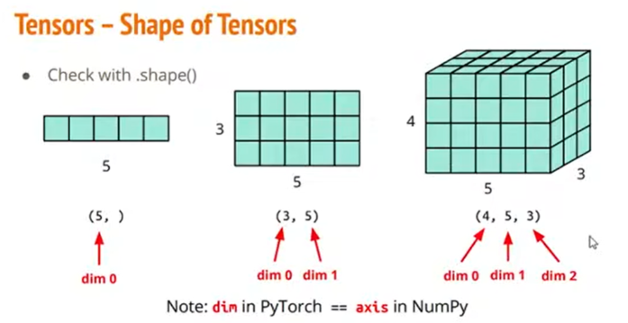
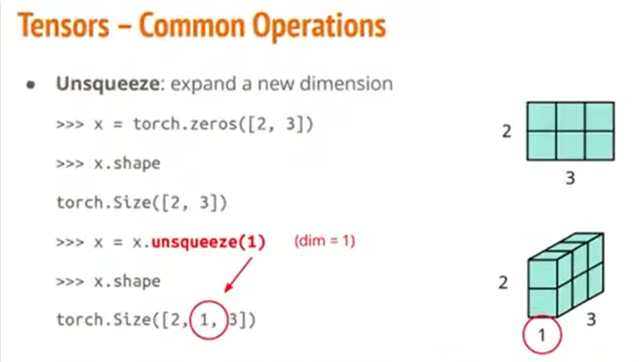
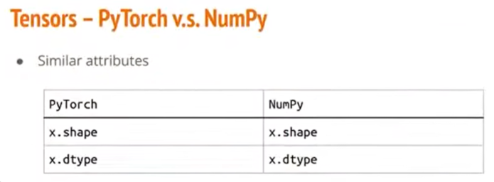
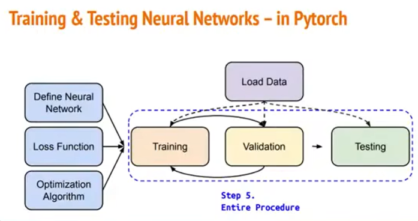
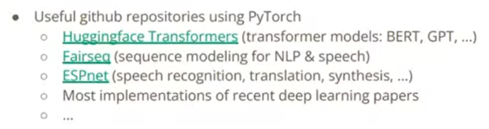

# PyTorch教学

## 一、训练一个神经网络

我们要训练一个神经网络，有三个步骤：

1）定义我们的神经网络，它里面有哪些层，长得什么样；

2）选我们要去最小化的那个Loss Function；

3）挑一个梯度下降的最优化算法，去优化我们的参数。

除了训练我们的神经网络之外，我们还要去做验证（validation）和测试（testing）。

在此，我们通常需要去反复地训练和验证，最后才会去做testing。

## 二、用PyTorch是怎么去做的

上述这些东西，我们用PyTorch是怎么去做的。

### （一）Dataset & DataLoader

首先从“到底要怎么把资料读入”开始。

在PyTorch里面有两个东西负责，一个是Dataset，一个是DataLoader。

Dataset做的事情就是把我们一开始的原始资料给一笔一笔地读进来。

DataLoader做的事情，就是把刚才Dataset读进来这一笔一笔的资料，给它合并成一个一个的Batch。

我们要先定义一个我们自己的Dataset，这时会有三个步骤：

1）首先要override一个initialization function，它的作用就是，当你去定义一个Dataset的时候，它会去自动调用init的方法。所以，在这个方法里面要做的事情，就是把资料给读进来，并且对它做一些你想要做的前处理；

2）其次是，当你在读取一笔一笔的资料的时候，它会去调用getitem这个方法，它可以去看看“我的第i笔资料是什么东西”；

3）第三个是len的方法，你要让你的DataLoader能够知道你的资料到底总共有多少，这样它再去算你的batch的时候，就会知道总共应该有几个batch。

此处举一个具体例子来说明。假设我们已经写好了一个Dataset的类（就像刚才图片显示的那样）。

我们DataLoader所做的事情，就是上图显示的那样。假设我们的batch_size=5，并且我们不去shuffle我们的资料。那么DataLoader会做的事情，就是会呼叫刚刚的Dataset五次，会调用getitem方法五次，从而得到5笔资料，把这5笔资料给合并成一个batch，以便于做后续的训练。

### （二）Tensors

#### （1）Tensor是什么

刚刚讲的是PyTorch怎样把数据读进来。现在的问题是，对于读进来的数据，PyTorch要怎样对它做处理呢？

在PyTorch里面我们读进来的东西通常都是一些矩阵、阵列，我们在PyTorch里面称呼它为Tensor。

Tensor就是一些高维的阵列，根据不同的处理，Tensor可能是一些一维阵列、二维阵列、三维阵列……。

如果你不知道你读进来的资料的大小到底是多大的话，你可以使用`.shape()`方法，可以看到你的资料的维度是多少，以及每个维度的大小是多少。

#### （2）怎么获得Tensor

刚才说了Tensor是什么。现在的问题是，怎么用Python去创造一些Tensor出来？

如果用过Python或者numpy的话，我们通常是用list或`np.array`去做运算，那么此时，由于torch已经有写好的方法，你就可以直接利用Python的`list`或者`np.array`直接去转换成Tensor。

或者，有些时候你想要做一些数值运算，你想要全部都是0，或者全部都是1的东西，你也可以用上图中下半部分展示的方法。

#### （3）Tensor相关操作

##### 1.基本数学运算

我们现在把数值作为Tensor读进来了，那我们可以对它做哪些操作呢？

很多操作，torch已经帮我们写好了，如上图所示。除上图的五种操作以外，还有很多其他的操作。

##### 2.transpose()

如果学过线性代数，就会知道，对于矩阵，有时我们会做一些维度互换的操作（转置），在torch当中它的方法叫做`transpose()`，如上图所示。说明，`transpose(0, 1)`的意思就是把“第0个维度”和“第1个维度”互换。

##### 3.sqeeze()

有些时候，我们有一个高维的阵列，例如上图，我们有一个`[1, 2, 3]`的阵列。其中有一个维度是`1`，我们想把这个维度给消除掉，把它变成一个二维的矩阵。我们就可以调用`sqeeze()`这个方法，来把那个维度消除掉。（根据图中的文字描述来看，sqeeze应该是只能消除长度为1的维度）

##### 4.unsqeeze()

也可以反过来操作，加一个维度。使用`unsqeeze()`方法，就可以在指定位置添加一个长度为1的维度。

##### 5.cat()

假设我们有很多个Tensor，我们想把它们合并成一个Tensor。

如上图，我们有x、y、z三个Tensor，（但是注意，它们有“一个面”的大小形状是相同的）我们想把它们沿着大小相同的那个轴合并起来，像w那样。我们可以使用方法`torch.cat()`。对于`dim=1`，意思是说，我们要让它们沿着“第1个维度”做合并。

##### 6.其他操作

上面只是概括性的介绍几个操作，实际上Tensor的相关操作还有很多。

### （三）使用Tensor时可能会遇到的问题

#### （1）数据类型

Tensor当中的数据，有些时候可能是小数，有些时候可能是整数。所以，当你的模型和你使用的data分别对应的是不同的数据类型的时候，就会有些错误。如果你看到是和`Data Type`有关的错误的话，就可以看看官方文档，看看这个问题要怎么调整。

#### （2）和numpy很相似

如果对numpy比较熟悉的话，在此处可能会发现，PyTorch和numpy在操作上有很多相似的方法。或者说，大部分在numpy上使用的方法，基本都能对应于PyTorch当中对应的方法。

比如查看大小、数据类型；调整矩阵大小、移除维度、增加维度……。

#### （3）Tensor在哪个Device上跑的问题

还有一个是你的Tensor在哪里跑的问题。

使用PyTorch的一个好处就是，它提供了一个方法，是我们可以把一些矩阵的运算放到GPU上面跑，这样会使运算变得更快。

但不是每台电脑都有GPU，所以我们需要跟PyTorch说，我们是要在GPU上运算还是CPU上。如上图所示。

怎么知道我的电脑能不能用GPU做运算？——可以使用`torch.cuda.is_available()`来看。

而如果你有好几颗GPU，你就需要具体说明是用哪一颗GPU来做运算。

#### （4）计算梯度时非常方便

PyTorch有两个好处，第一个好处是，它可以用GPU做加速。第二个好处是，它在去计算梯度的时候非常方便。

到底有多方便呢？

如上图所示，先看右下角，我们有一个`2*2`的矩阵x；然后有一个变量z，z的公式是矩阵x各元素的平方和；根据z的公式可以算出z对x的偏微分；于是就可以求得z对x矩阵的偏微分矩阵。（也就是之前讲过的gradient）

那么如果在PyTorch里面，是怎么做的？如上图中，左上角所示。你只要先定义好你的Tensor，也就是你的矩阵x（此处特别想要计算梯度，所以令`requires_grad=True`）；把变量z的表达式写好；然后调用`z.backward()`来算微分；最后调用`x.grad`来看看微分长什么样子。

### （四）Training

上面的部分都是在讲资料如何处理，如何把资料读进来，让PyTorch去使用。

接下来要讲，真正在Training的过程当中，要怎么用PyTorch去做。

#### （1）Define Neural Network

Training过程中的第一个问题，就是该怎样定义神经网络。

##### 1.Linear Layer

如图，`nn.Linear(32, 64)`的意思是，input的维度的最后一位必须是32大小（前面的维度是多大都行），output的维度的最后一位一定是64大小。

在PyTorch里是怎么调用Linear Layer的，如下：

##### 2.非线性的函数

除了Linear Layer，在做神经网络训练的时候，还可能会用到很多非线性的函数，比如Sigmoid和ReLU。 这些在PyTorch里面都已经写好了，只需直接使用就可以。

##### 3.怎么组成神经网络

那到底要怎么用刚才所提到的Layer，还有非线性函数，来组成我的神经网络？

类似于刚刚的Dataset定义方法，我们首先要override一下torch已经写好的nn.Model这个class，去定义我们自己的模型。

在这个类中，我们首先要override我们的initialization function，在里面写出我们的模型是由哪几部分组成。如上图所示，是一个很简单的模型，它的第一层是一个Linear Layer，第二层是一个Sigmoid非线性函数，第三层又是一个Linear Layer。

定义我的模型的init方法，此时只是定义了我的模型有哪些层。然后我还要去定义我的模型到底要做哪些运算，所以必须要再去override一个forward方法，去说：我的模型得到一个输入资料以后，到底要去做什么样的运算。

具体来说上面这个图当中的写法，在init当中使用了一个`nn.Sequential()`把三层给包起来形成一个整个的方法net，然后在`forward`里面去调用这个net方法，作用到我们的输入x上面。

上图中说明的是，也可以把Sequential包起来的东西全部拆开来写。

#### （2）Loss Function

Loss Function是我们的神经网络想要去最小化的一个东西。可能是各式各样的误差。

在PyTorch里面，已经帮你定义好比较常用的Loss Function了。在不同的任务中可能要用到不同的Loss Function。

那么，在PyTorch里面，你只需要先想好你想用什么方式，把它套用在模型的输出上面，就可以得到一个Loss。之后再去考虑如何把Loss变得越来越小的问题。

#### （3）Optimization Algorithm

获取资料、定义自己的神经网络、获取Loss Function。接下来要讲的就是Optimization算法。

同样，就像Loss Function的获取那样，PyTorch已经帮我们定义了一些常见的优化算法。

对于不同的任务，需要用到不同的优化算法。上图是对于SGD演算法的使用示例。

我们在定义好某个演算法之后，在实际训练中使用这个演算法，有三个步骤：

1）把上一步计算出的梯度给归零；

2）调用`.backward()`，即我们要把算出来的结果进行回推，去算每一层的梯度；

3）调用`.step()`，根据上一步计算出来的梯度去调整模型的参数。

### （五）整个流程

我们现在知道怎么读取资料，怎么定义自己的神经网络，怎么获得Loss Function，怎么优化参数了。

那么从整体来看，我们这三步：Training、Validation、Testing分别要怎么做呢？

#### （1）训练的部分

整个步骤会是这个样子：

1）首先，定义资料的获取。定义一个Dataset，然后定义一个DataLoader把Dataset包起来；

2）然后定义好我们的模型，并把它放到CPU或GPU上；

3）之后，定义好我们的Loss Function，定义好我们的优化算法。

然后就可以准备开始做训练了。

整个训练的过程如上图所示。

第一个for循环是说，我们要把整个资料集给跑过几次。

1）在每一轮训练中，首先第一件要做的事情是把模型给调到训练模式，即`model.train()`；

2）接下来就是把DataLoader里面的每一个Batch的资料去做处理。

第二个for循环中的x和y，x是模型的输入，y是模型预期的结果。这层循环是要把整个数据集给跑过一遍为止。

1）如同刚才在Optimization算法当中所说，一开始要先把我们算法的上一轮迭代算过的梯度给归零；

2）然后要把资料移动到正确的CPU或GPU上面；

3）把输入资料x放到模型里面，得到模型产生的结果；

4）得到模型产生的结果后，把它跟真正预期的结果相对比，去算出loss；

5）得到loss以后，去算梯度；

6）算完梯度以后，用Optimization算法去调整模型的参数。

#### （2）验证的部分

测试的部分和训练的部分很像，只有两个差别：

1）要把模型调到测试模式，即`model.eval()`；

2）在计算我们模型的结果和loss的时候，要特别跟torch说，把梯度计算给关掉。

除此之外，其他过程是差不多的。我们把资料给移动到对应的CPU或GPU上面，然后计算一个输入x以及预期输出y，然后把模型输出结果和预期输出y对比去计算loss，然后去算一下我们的模型目前算出来的loss平均是多少。

#### （3）测试的部分

实际在做测试的时候，也是跟刚刚所做的事情差不多。

只不过我们在做测试的时候，我们不知道这个资料它预期的输出会是什么样子。所以我们的Testing数据集里就只有“输入x”这个资料。我们得到输入x这个资料后，并且特别把梯度计算给关掉以后，去计算模型拿到x这个输入以后会得到的输出，并且我们把所有的输出给统计下来。

#### （4）为什么要设置model的模式，以及为什么要把梯度计算关掉

**问题一：为什么要设置“训练模式”或“测试模式”**

现在似乎看不出来差别，但是在之后，有些模型的一些层次上，像是dropout、batch normolization，它们在训练和测试的时候，所做的事情是不一样的。因此，我们需要特别去强调我们现在是在做训练还是在做测试。

**问题二：为什么在Validating、Testing的时候要把梯度计算给关掉**

梯度本身是用于调整模型参数的。但是我们在做测试的时候，或者在做验证的时候，我们不需要再去做参数调整这件事情。所以，把梯度计算关掉，会跑的比较快，因为把没必要的操作给省略了。

另一个方面来说，如果你非要开着梯度计算，也有可能造成不好的结果，如果你的程序写的不太严谨的话，你把梯度计算打开，你可能就不小心拿着测试资料、验证资料去“训练模型”了。所以，把梯度计算给关掉，可以确保一定不会拿着Validation、Testing的资料去做修正模型参数这件事。

### （六）保存/加载模型

总之，好不容易我们把我们的模型给训练好了。那得把它存起来。

想把它存起来的话，那就调用`torch.save()`；要把存起来的模型给读出来使用，那就调用`torch.load()`。

## 三、补充说明

PyTorch是目前做深度学习最热门的一个套件。它现在被拿来在各个领域中做机器学习，比如语音处理、自然语言处理、视觉处理等。

如果对机器学习的应用有兴趣的话，现在很多在github上面的repository，它们都是用PyTorch做的。比如很有名的自然语言处理的BERT模型；GPT的一个repository叫Huggingface。

除此之外，在大部分学界的论文都是用PyTorch去写的。