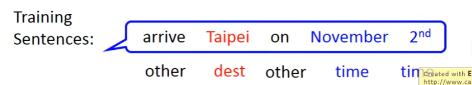
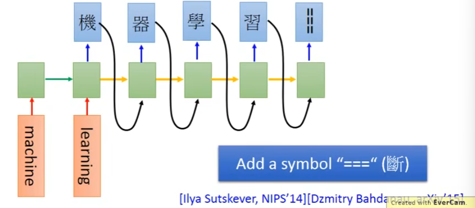

# Recurrent Neural Network（RNN）

## 一、Example Application

### （一）Slot Filling

现在一些很流行的智能客服、智能订票系统，在这些系统里面你往往需要Slot Filling这种技术。

Slot Filling技术就是，假设有一个人给你的系统说：“I would like to arrive Taipei on November 2nd.”，那么你的订票系统就要自动知道这里面有一些slot。

比如在这个订票系统里面，它会有一个slot叫Destination，会有一个slot叫time of arrival。那么你的系统要自动知道这句话里面的每一个词汇，它属于哪一个slot。——你的系统要知道Taipei属于Destination这个slot，November 2nd属于time of arrival这个slot，而其他的词汇不属于任何slot。

其实这个问题也可以用一个Feedforward的neural network来解决。也就是说，我叠一个feedforward neural network，它的input是一个词汇，比如说你把Taipei变成一个向量，丢到这个neural network里面去。

你要把一个词汇丢到neural network里面去，你要先用一个向量来表示它。——怎么把一个词汇用向量表示呢？方法就太多了。

有一个方法叫“1-of-N encoding”。

还有一些其他的方法。

总之，你把一个词汇作为一个vector丢进一个feedforward neural network里面去，你会希望output是一个probability distribution。probability distribution代表我们现在input的这个词汇属于每一个slot的几率。举例来说，输入“Taipei”，输出它属于Destination和time of arrival的几率。

但是，只有这样是不够的，feedforward方法没有办法解决这个问题。为什么呢？

假设现在有一个使用者说：“arrive Taipei on November 2nd.”，没问题。

但是有另一个使用者说：“leave Taipei on November 2nd.”——那这个时候，Taipei就应该是place of departure，即出发地，而不是目的地。

但是对neural network来说，input一样的东西，output就应该是一样的东西。——你input一个“Taipei”，它的输出结果要么是“是出发地的几率最高”，要么是“是目的地的几率最高”，你没有办法让它“有时候是出发地的几率最高，有时候是目的地的几率最高”。

那怎么办呢？我们此时就希望neural network它是有记忆力的。——如果今天neural network是有记忆力的，它记得它在看过这个“红色的Taipei”之前（如图），它已经看过“arrive”这个词汇；而它记得它在看过这个“绿色的Taipei”之前（如图），它已经看过“leave”这个词汇。它就可以根据这段话的上下文产生不同的output。

所以，如果我们让我们的neural network是有记忆力的话，它就可以解决，input是同一个词汇，但是output必须是不同结果，这个问题。

那这种有记忆力的neural network，就叫做“Recurrent Neural Network（RNN）”。

在RNN里面，每一次我们Hidden Layer里面的neuron产生output的时候，这个output都会被存到memory里面去。之后，这些neuron就不是只会考虑input的$x_1,x_2$了，它还会考虑存在这些memory里面的东西。

#### Example

举一个具体的例子。

现在图上这个network，所有的weight都是1，并且没有bias。并且假设所有的activation function都是Linear。（这样的目的是让计算不会太复杂）

我们的input是一个sequence：`[1 1], [1 1], [2 2], ...`。

把它输入到这个Recurrent Neural Network里面去，会发生什么事情呢？

首先，在你开始要使用这个RNN的时候，你必须要给memory初始值。假设说现在memory还没有放进去任何东西的时候，初始值是0。

现在，输入：`[1 1]`。会发生什么事呢？

对于左侧绿色的那个neuron来说，它不光接收到input的1跟1，它还接收到了memory中的0跟0。——因为我们说所有的weight都是1，而且没有bias，是Linear，所以这两个绿色neuron的output都应该是2。

同理，这两个红色neuron的output都是4。

综上可知，对于`input sequence：[1 1], [1 1], [2 2]`中的第一个input向量`[1 1]`，它的output就是`[4 4]`。

接下来，这个RNN会把绿色neuron的output存到memory里面去。所以，memory里面的值会被更新为2和2。

接下来，再输入第二个input向量`[1 1]`。

这时候绿色neuron会有什么输出呢？它的输入有4个：input的1和1，以及memory的2和2。又因为weight都是1，没有bias，所以绿色neuron此时的output就是`1+1+2+2=6`。红色neuron的输出就是`6+6=12`。

所以，当第二次输入`[1 1]`的时候，它的输出就是`[12 12]`。

由此可见，对Recurrent Neural Network来说，就算你给它输入一样的东西，它的output是有可能不一样的，因为存在memory里面的值。

同理，下一步，memory里面的值会被更新为6和6。接下来，input的向量是`[2 2]`，那么绿色neuron的输出就会是`2+2+6+6=16`，红色neuron的输出是`16+16=32`。

今天在做RNN的时候，有一件很重要的事情，就是，这个input sequence，RNN在考虑它的时候，如果你调换它的顺序，比如说把`[2 2]`移动到最前面来，那得到的output sequence是会完全不一样的。——所以，在RNN里面，它会考虑input sequence的order。

#### RNN

所以，今天RNN在考虑slot filling这个问题的时候，它就会是这样一个过程。

使用者说：“arrive Taipei on November 2nd.”每个词汇是一个input，整个句子是一个input sequence。

那么首先，第一个input，“arrive”被输入进去，得到一个结果。注意，它中间的Hidden Layer是有记忆功能的，即，图中绿色的neuron的output会存储到memory中。

然后，第二个input，“Taipei”被输入进去，此时注意，中间Hidden Layer在处理的时候，不仅会考虑input，还会考虑memory中的内容。

（注意，这张图不是三个不同的Network，而是同一个Network前后被使用三次，每次使用时的具体情况）

所以，如果我们有了memory以后，刚才我们讲的“输入同一个词汇，希望有不同的output”这个问题，就有可能被解决。

如上图，虽然输入都是“Taipei”，但由于它们前面分别是“leave”与“arrive”，所以它们memory中的vector是不同的，就会导致有不同的output。

#### Of course it can be deep...

我们刚才举的例子中，RNN只有一个Hidden Layer，当然，它可以是Deep的Recurrent Neural Network。——那么同样，每一个Hidden Layer都会把上一次的output作为memory，运用到下一次中去。

### （二）Elman Network & Jordan Network

Recurrent Neural Network有不同的变形。

我们刚才讲的其实是Elman Network，即，如果你把每个neuron在这一个时间点的值存起来，用到下一个时间点中去，这种的就叫Elman Network。

Jordan Network是把整个Network最终的output存起来。——传说，Jordan Network可以得到比较好的performance。因为，中间的Hidden Layer的值是没有target的，无法控制它学习到的东西；而最终的output是有target的，可以控制它学到什么东西。

### （三）Bidirectional RNN

RNN还可以是双向。

什么意思呢？比如我们刚才要input一个句子的话，它的顺序就是“从句首读到句尾”。如果把句子当中每个词汇用$x^t$表示的话，它就是依次读$x^t,x^{t+1},x^{t+2},...$。

但是，它的读取方向，其实是可以反过来的。它可以按$x^{t+2},x^{t+1},x^t,...$的顺序依次去读。

你可以同时train一个正向的RNN，同时再train一个逆向的RNN，然后把这两个RNN的Hidden Layer拿出来，都接给一个output Layer，让它output出来一个$y^t$。

用Bidirectional RNN的好处是，它在产生output的时候，它看的范围是比较广的。

如果你只用正向的RNN，那你的RNN在产生$y^{t+1}$的时候，它的记忆就是只看过$x_1,...,x^{t+1}$的input。

如果我们今天是Bidirectional RNN，那它在产生$y^{t+1}$的时候，它不仅看了句首到$x^{t+1}$的input，它还看了句尾到$x^{t+1}$的input。——如果是slot filling问题的话，相当于你已经看过了整个句子之后，再来决定这个词汇是什么。这样会比只看句子的一半，得到更好的performance。

### （四）Long Short-term Memory（LSTM）

我们刚才讲的，其实都只是RNN的最简单的版本。

我们刚才讲的memory是一个最单纯的memory。我们随时都可以把memory写进去，随时都可以从memory读出。

但是，现在最常用的memory，其实是被称为Long Short-term的memory。

这种LSTM的memory，它有三个gate。

**input Gate**

当外界，即某个neuron的output想要被写入memory cell里面的时候，它必须先通过一个“闸门”，即一个“input Gate”。只有当这个input Gate打开的时候，你才能够把值写入memory cell里面去。如果它被关起来的时候，其他的neuron就没有办法把值写进去。——而至于这个input Gate什么时候打开、关起来，这个是neural network自己学的。它可以自己学，什么时候要把input Gate打开，什么时候要把input Gate关起来。

**output Gate**

输出的地方，也有一个“output Gate”。它决定着其他的neuron能不能从外界，把这个值读取出来。当output Gate关闭的时候，就没有办法把值读出来；当output Gate打开的时候，才可以把值读出来。——和input Gate一样，这个output Gate什么时候打开、什么时候关起来，也是network自己学到的。

**Forget Gate**

Forget Gate的功能是，决定这个memory cell什么时候把过去记得的东西给Forget掉。——这个Forget Gate，什么时候会把存在memory里面的值给forget掉，什么时候会把memory里面的值继续保留下来，这个也是network自己学到的。

对于整个LSTM，你可以看做“4个input，1个output”。这4个input分别是：想要被存进memory cell的值，操纵input Gate的讯号，操纵output Gate的讯号，操纵forget Gate的讯号。但最终只有一个output。

这里还有一个冷知识，即，“Long Short-term Memory”，这个`"-"`加的位置对吗？有人还会写成“Long-Short Term Memory”，哪一个对？——前者对。因为，回顾一下刚才我们讲的比较simple的版本，它的memory是在每一轮input后都要被清洗一遍的，所以它的“term”很短，即“Short-term”，而在LSTM当中，由于各个Gate的限制，会让它变得长一些，所以是“长一些的Short-term”，即”Long Short-term“。

上面LSTM的memory cell，如果更仔细地去看它的formulation的话，它长下面这个样子。

想要写入memory cell的值记作$Z$，操纵各个Gate的值分别被记作$Z_i,Z_f,Z_O$，output被记作$a$。

假设memory cell中存的值是$c$。对于input的$Z$、input Gate的$Z_i$、forget Gate的$Z_f$，分别都要经过一个function。得到$g(Z),f(Z_i),f(Z_f)$。经过如图所示的运算，得到一个新的值$c'$，并把memory cell中的值由原来的$c$更新为$c'$。

对于$f()$，通常是一个Sigmoid function，因为它的值介于0和1之间，就相当于一个“闸门”。例如$g(z)f(z_i)$，如果$f(z_i)$得0的话，就说明完全不能input进来，如果$f(z_i)$得1的话，就相当于是直接将$Z$本身给input进来。同理，对于$cf(Z_f)$，假设$f(Z_f)$是1，就说明仍然把原来的$c$给记住，而假设$f(Z_f)$是0，就说明把原来的$c$给完全忘记了。——我们把$g(z)f(z_i)$和$cf(Z_f)$加起来，作为新的$c'$存入到memory cell中。

观察计算公式，其实可以发现一个问题，就是这个forget Gate的值，其实是和我们直觉相反的。——我们从直觉上会觉得，这个forget Gate打开的时候（为1的时候），应该执行的是forget功能，反之应该是记住。但从公式上而言，它为1的时候，是记住；它为0的时候，是forget。

把$c'$再通过函数h得到一个$h(c')$，而output Gate同样得到一个$f(Z_O)$与之相乘，得到最终的输出$a$。

#### LSTM - Example

我们要举的例子是这样的：我们的network里面只有一个LSTM的cell，我们的input都是三维的vector，output都是一维的vector。

这个三维的vector，它和output，以及和memory里的值的关系是什么。这个关系是这样的：

- 假设第二个dimension，即$x_2$的值，是1的时候，$x_1$的值就会被写到memory里面去；
- 假设$x_2=-1$的时候，memory就会被reset，即memory里面的值就会被遗忘；
- 假设$x_3=1$的时候，memory才会被打开，才可以看到memory的输出。

所以，如果memory里面存的初始值是0（图中上侧蓝色方框），那么它在经历每个input的时候，其中值的变化情况如图所示。

下面我们来实际做一下LSTM内部的运算。

我们知道对于一个memory cell，总共有4个input的scalar。这4个input的scalar是怎么来的呢，就是输入的那个三维的vector，乘上一个Linear的transform以后，所得到的结果。简单来说，就是把三维vector中的$x_1,x_2,x_3$各自乘上不同的值（weight），再加一个bias，就行了。

至于这些weight是多少，bias是多少，都是透过你的Training data去学会的。

现在我们要做的是，假设这些参数已经学好了，就是图中这些参数了，我们该怎样去计算它们。

注意，对于图中的$g(),h()$函数，我们将其看作Linear function，来简化计算。另外，对于每一个Gate所对应的$f()$函数，它们都是Sigmoid function。通过对图中参数的分析，我们可以这样理解：

- 对于input Gate，它的$x_2$要乘上100，而$bias=-10$，因此可以理解为，它平时通常是关闭状态，而只有当$x_2$比较大的时候，它才开放的比较大；
- 对于forget Gate，它的$x_2$要乘上100，而$bias=10$，因此可以理解为，它平时通常就是打开状态，即倾向于forget，而只有当$x_2$负的比较大的时候，它才会倾向于0。
- 对于output Gate，它的$x_3$要乘上100，此处和input Gate同理。

**对于第一个input，即[3 1 0]**

我们输入`[3 1 0]`时，首先，经过$g()$得到的结果是3，对于input Gate和forget Gate的这两个Sigmoid function，它们的值都是接近于1的。因此，最后计算出$c'=3$，即memory cell中存放的值是3。但是，output Gate的值是接近于0的，因此，整个的output最终还是0。

**对于第二个input，即[4 1 0]**

**对于第三个input，[2 0 0]**

**对于第四个input，即[1 0 1]**

**对于第五个input，即[3 -1 0]**

看到这里，你会感觉，它这个东西，跟我们之前学习的neural network，感觉一点都不像啊。它和原来的neural network到底有什么关系呢？

对于一个普通的network，我们是把每一个输出乘上一个weight，作为不同neuron的输入，每一个neuron都是一个function，它输入一个scalar，输出另外一个scalar。

如果是LSTM的话，其实你只需要把LSTM的memory cell想成是一个neuron就好了。

所以，如果今天我们要用一个LSTM的neural network，你需要做的事情，只是把原来“简单的neuron”换成一个LSTM的memory cell。——而原来的input，如$x_1,x_2$，它会乘上不同的weight，来作为LSTM的输入。

在原来的neural network中，对于每一个neuron而言只是一个input、一个output。但是在LSTM这里，它需要4个input，才能够产生一个output。

由于这4个input的参数是各自不一样的，所以它的参数量会是一般的neuron network的四倍。

不过讲到这里，你可能还是不太理解，它跟RNN有什么关系。看到这里，似乎它和RNN就不太像了。所以，接下来要再画另外一个图来表示它。

#### LSTM的另一个画法

假设我们现在有一排的LSTM，每一个LSTM的cell里面都存了一个值、一个scalar。——把所有的scalar接起来，就形成了一个vector。

所有LSTM的cell当中的scalar，拼接起来形成了一个vector，$c^{t-1}$，

对于t时刻的input，是一个向量$x^t$，它先乘上一个矩阵，得到$Z$，对于输入$Z$，它的每个dimension分别对应于各个LSTM的输入。即，$Z$的第一个dimension是第一个LSTM的输入，第二个dimension是第二个LSTM的输入……。

对于向量$x^t$，它会再乘上一个矩阵，得到$Z^i$，它的每一维对应于一个LSTM，操控对应的input Gate。

对于forget Gate，和output Gate，也是同理，不再赘述。

所以，我们把$x^t$乘上四个transform，得到四个vectors。这四个vector合起来，就会去操纵各个LSTM的运作。

现在，这个LSTM就长这样。注意，对于图上的input，$Z,Z^i,Z^f,Z^O$，我们对于每个LSTM实际上是只输入了其中一个dimension。

首先，要把$Z^i$通过一个$f()$，然后和$Z$相乘，如下图所示。

之后，$Z^f$也要通过$f()$，然后和之前已经存在于cell里面的值相乘，如下图所示。

接下来，要把这两个值加起来，如下图所示。

最后，再经过一个output Gate，得到最终的output，如下图所示。

而且，此时这个memory cell里面存放的值，就是$c^t$。

那么，这件事情就可以反复下去。在下一个时间点，input是$x^{t+1}$，然后执行相同的流程，注意，此时存在于cell里面的值已经变成了$c^t$。如下图所示。

但是，这其实不是LSTM的最终形态，上述过程也只是一个simple的版本。

真正的LSTM会怎么做呢？——它会把最终output之前那层Hidden Layer的输出接进来，和下一次的$x^t$一起，作为输出。

也就是说，它不止会考虑当前的$x^t$，它还会考虑上一次output的输出$h^{t-1}$，把它加进来一块作为这一次的输入。

其实还不止这样，还有一个东西叫“peephole”。它是把存在memory里面的值，也拉过来，和$h,x$一起，作为输入上的考虑。

总之，真正在考虑四个input的时候，你实际上是同时考虑了$x,h,c$。——这三个vector并在一起，乘上四个不同的transform，得到四个不同的vectors，再去操纵不同的LSTM。

LSTM也不会只有一层，现在通常会叠个五六层的样子。所以它就大概长下图这个样子。

很多人在第一次看到这个图，都会怀疑它是个什么东西。但是实际上现在它很常见，是一个标准的过程了。很多人说他在做RNN的东西，实际上他就是在做LSTM。

至于上面讲的过程不太理解，也不必担心，因为用Keras可以直接调用LSTM来解决它。Keras实际上还支持“GRU”（比LSTM稍微简化一点），以及我们最开始讲的那种最简单的RNN，即“SimpleRNN”。

## 二、RNN怎么做learning

现在的问题是，Recurrent Neural Network怎么做learning。

我们说过，如果要做learning的话，你要定一个loss function，来evaluate你的model的parameter是好还是不好，然后你选一个model parameter，可以让这个loss最小。

那在RNN里面，会怎么定这个loss呢？

### （一）Loss Function

以下，我们不写算式，而是直接举一个例子。

假设我们现在要做的事情是slot filling，那你会有training data，这个training data是给你一些sentence。

然后，你要给sentence给它label，告诉说：“第一个词属于other这个slot，第二个词属于destination，on属于other，November和2nd都属于time……”。

接下来，你会希望你的loss要怎么定呢？把arrive丢到RNN中的时候，RNN会output一个$y^1$，这个$y^1$会含一个reference vector——现在我们丢进去一个arrive，输出$y^1$的reference vector应该是对应到other的那个slot的dimension的value值。——这个reference vector的长度就是你的slot的数目。——假设你有40个slot，那么这个reference vector的dimension就应该是40，假设你这个词对应的是other这个slot的话，那对应到other那个dimension就是1，其他的就是0。

所以你要计算的loss，就是每一个时间点的RNN的output，跟reference vector的cross entropy的和，就是你要去minimize的对象。

那现在有了这个loss function了以后，training要怎么做呢？

### （二）Training

Training其实也是用Gradient Descent。也就是说，如果我们现在已经定出了Loss Function，即$L()$，我要update这个network里面的某个参数$w$。

怎么做？就计算L对w的偏微分，这个偏微分计算出来以后，就用Gradient Descent的方法去update这个参数。——这个道理已经讲过很多次了。

另外，在讲feedforward network的时候，我们说Gradient Descent用在feedforward network里面，你要用一个有效的演算法，叫做Backpropagation。

在RNN里面，Gradient Descent原理是一模一样。但是为了计算方便，也有开发一套演算法，这套演算法是Backpropagation的进阶版，它叫做BPTT。

它跟Backpropagation是很类似的。只不过RNN是在sequence上面运作，所以BPTT需要考虑时间的information。

这里也不讲BPTT。反正你知道RNN是可以train的，是用Gradient Descent进行训练的，就行了。

### （三）Unfortunately...

**RNN-based network is not always easy to learn.**

但比较不幸的是，RNN的Training是比较困难的。

一般而言，你在做Training的时候，你会期待你的learning curve是像下图蓝色的这条线。

图中的纵轴是Total Loss，横轴是training的时候Epoch的数目。

你会希望说，随着Epoch越来越多，随着参数不断的update，Loss应该就是慢慢慢慢地下降，最后趋向收敛。

但是，不幸的是，当你在训练这个RNN的时候，你有时候会看到绿色的这一条线。——你的第一个想法可能就是，程序有bug？ 

其实这是RNN的一种特性，下面放个图，具体的我没太听懂，不想记了。它的error surface很崎岖，有一些断崖式的地方。导致很难训练，波动非常大。

为什么RNN会有这种问题？

RNN的training的问题其实来自于他把同样的东西在反复使用。从memory接到neuron，这一转换在不同的时间点都是被反复使用。所以，里面的这个weight，它也许可能不会造成影响，但是一旦造成影响了，这个影响就会是一个天崩地裂的影响。总之，RNN不好训练的原因，不是因为里面的Sigmoid Function或者什么，而是因为它有这个sequence。

LSTM可以解决Gradient Vanishing的问题。【这块其实也没太听懂，截个图放在这里】

## 三、More Applications...

其实RNN有很多的application，在我们前面举的那个slot filling的例子里面，我们是假设input和output的element是一样多的。有几个word，我们就给每个word一个slot的label。

但事实上RNN可以做到更复杂的事情。

### Input is a vector sequence, but output is only one vector.
 
 比如说，input可以是一个sequence，而output可以只是一个vector。

这有什么应用呢？比如说你可以做Sentiment Analysis。

什么意思呢。比如，某家公司想要知道他们的产品在网络上的评价是好还是坏，他们可能就会写一个爬虫，把跟他们产品评价有关系的网络上的文章都爬下来。但是一篇篇看着太累，所以可以用一个机器学习的方法，自动learn一个classifier去分类，说哪些文章是正向的，哪些文章是负向的。

怎样让机器做到这件事情呢，你就可以learn一个RNN，input是一个character sequence，然后，RNN把这个character sequence读过一遍。在最后一个时间点，把Hidden Layer拿出来，可能再经过几个transform，然后就能得到最后的Sentiment Analysis。

或者是Key Term Extraction。

比如你今天搜集到了一堆文章，并且每一个文章都对应提到它当中哪些是key word的话，那你就可以直接train一个RNN。这个RNN把document当中的word sequence当做一个input。【具体也没太懂，贴个截图在这里】

### Both input and output are sequences, but the output is shorter.

也可以是多对多的，但是output比input的sequence短。

什么样的任务是，input长、output短呢？

比如说，语音辨识就是这样一个任务。输入是一段声音讯号，输出是character sequence。

对于上图的解释：如果我们还沿用原来的那种RNN的话（像slot filling例子中讲的），它充其量会对每一个vector对应一个输出。输出就是从所有的中文词库里面挑选一个最有可能的word。我们也说过，声音讯号是每隔10ms就取一个vector。所以，它RNN的输出结果可能就是“好好好棒棒棒棒棒”，因为每一个vector要对应一个文字。

那怎么获得我们想要的“好棒”呢？就使用Trimming技术，其实就是把重复的内容去除。——但是这样也会产生一个问题，它就无法输出“好棒棒”这样的内容了。

那到底怎么处理，才能不影响我们获得“好棒棒”这样的输出结果？

有一招叫做CTC。这一招也是那种说穿了就不值钱的办法，但是这招很神秘。

我们在output的时候，我们不要只是output所有的中文character。我们还多output一个符号$\phi$，也就是$null$，也就是“没有任何东西”。

所以，今天我输入一段语音讯号，它的output是$好\phi \phi 棒\phi\phi\phi\phi$，然后再把$\phi$的部分拿掉，它就变成好棒。如果我们输入另外一段语音，它的output是$好\phi\phi棒\phi棒\phi\phi$，它的output就是“好棒棒”。——就可以解决叠字的问题了。

那在训练的过程中，CTC是怎么做训练的呢？【这里就不细讲了】

### Both input and output are sequences with different lengths.

比如翻译。不知道是output更长，还是output更短。

还可以通过input一段语音讯号，完全不做语音辨识，而是直接输出翻译好的文字结果。下图是Google发的一篇论文。这招看起来是行得通的。

如果这个东西能够成功的话，它可以给我们带来的好处是，我们在搜集translation training data的时候会比较容易。假设你今天要把某种方言转换成英文，但是这种方言的语音辨识其实是比较不好做的，因为这种方言可能根本就没有一个标准的文字系统，所以要找出对应的label会比较麻烦。所以如果这样的技术可以成功的话，你只需要搜集方言的声音讯号，和它英文的翻译，就可以了，你就不需要方言的语音辨识的结果，你不需要知道方言对应的文字，你也可以做这种翻译。

### Beyond Sequence

【不是很懂，随便贴一些截图放在这】

【下面讲了一些Sequence-to-sequence的东西，听不懂，不记了】

## 四、Attention-based Model

其实现在除了RNN以外，还有另外一种有用到memory的network，叫做Attention-based Model，它可以理解为是RNN的一个进阶版本。

我们知道，人的大脑有非常强的记忆力，你可以记得非常多的东西。比如说你现在可能同时记得：“早餐吃了什么”、“10年前的夏天发生了什么事”、“你在这门课里学到了什么东西”……

这时，有人问你“什么是Deep learning？”的时候，你的脑中就要去提取重要的information，再把这些information组织起来产生答案。但是，你的脑子会自动忽略掉那些无关的事情，比如“10年前的夏天发生的事情”。

其实machine也可以做到类似的事情。

machine也可以有很大的记忆的容量，它可以有一个很大的database，在这个database里面，每一个vector就代表了某种information，被存放在虚拟的记忆里面。

当你输入一个input的时候，这个input会被丢进一个中央处理器，这个中央处理器可能是一个DNN或者是一个RNN。这个中央处理器会操控一个读写头，操控一个reading head controller，这个reading head controller会去决定这个reading head放的位置。machine再从这个reading head放的位置里面去读取information出来，然后产生最终的output。

这个Model还有一个`2.0`的版本。这个版本，它回去操控一个writing head controller，这个writing head controller会去决定writing head放的位置，然后machine会去把information透过这个writing head写进它的database。即，它不只是有读的功能，它还可以把它发现到的东西写到它的memory里面去。

这个东西就是大名鼎鼎的`Neural Turing Machine`。这些其实都是很新的东西。

### （一）Reading Comprehension

Attention-based Model现在常常被用在Reading Comprehension里面。

所谓的Reading Comprehension就是让我们现在去读一堆document，它把document里面的内容，每一句话，变成一个vector，每一个vector代表了某一句话的语义。

接下来，你问machine一个问题，然后这个问题被丢进一个中央处理器里面，中央处理器控制了一个Reading head controller，去决定说现在在这个database里面，哪些句子是跟现在的问题有关的。假设它发现某个information是和问题有关的，它就把Reading head放到那个地方，然后把information读到中央处理器里。注意，这里的读取information并不一定只是从一个地方读，它可以是从多个地方读。读完一个，再读下一个。总之，最终读完所有它需要的information，然后给出一个answer。

【这里不是很懂，放个截图在这】machine自动会决定要去看哪个句子。

### （二）Visual Question Answering

machine也可以做video的Question answer。

video的Question answer就是让它去看一张图，然后问它一个问题。

比如下面的例子，让它看这张图，然后问这张图里有什么。如果它能够回答“香蕉”的话，它就超越了一部分人类。

这个Visual Question Answering怎么做呢？

就是让machine看一张图，然后透过CNN，你可以把这张图的一小块region用一个vector来表示。

接下来，输入一个query，然后这个query被丢到中央处理器里面，中央处理器去操控了Reading head controller，这个Reading head controller决定了它要读取资讯的位置，看看这张图片的什么位置是跟现在输入的问题是有关的。把读取的information放入中央处理器里面。同样，这个读取可能有好几处。

### （三）Speech Question Answering

也可以做语音的Question answering。

比如我们让machine做托福的听力测验。就是让machine听一段声音，然后问它问题，然后从4个正确选项里面选出正确选项。

machine做的事情，和人类考生做的事情其实是一样的。

我们用来训练和测试的资料，就是托福听力测验的资料。

和刚才说的步骤差不多。machine先看Question，得到问题的语义，再听声音，把声音做语音辨识，并得到声音的语义。然后再做一个Attention，去决定声音里面的哪些部分是和回答问题有关的。最后得到一个答案。此外，它甚至还可以拿着它的答案再回去看看，修正它得到的答案。最终得到一个最终答案，然后再去看看哪个选项和答案的相似度最高，它就选那个选项。

## 五、Deep Learning和Structure Learning有什么不同

【这里不是很懂，不记了】