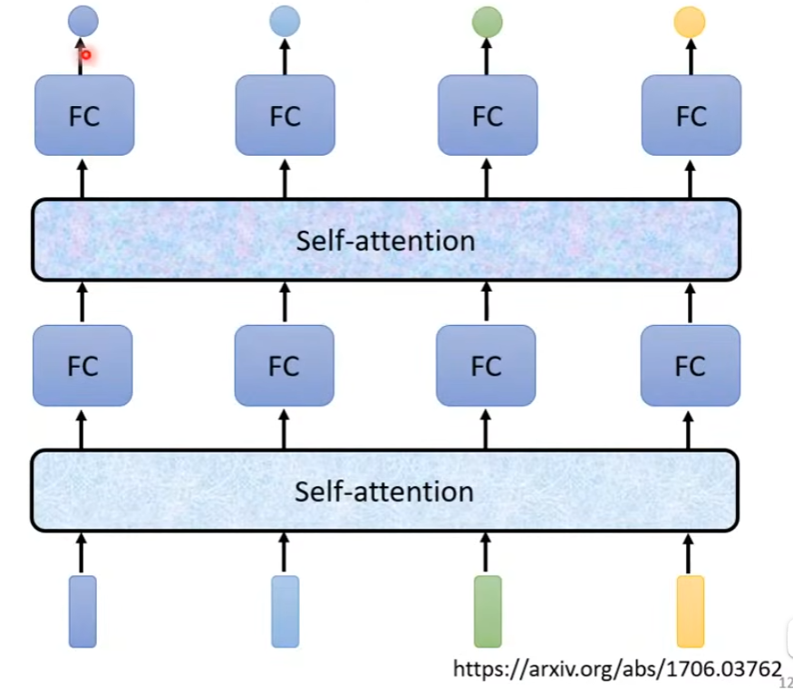
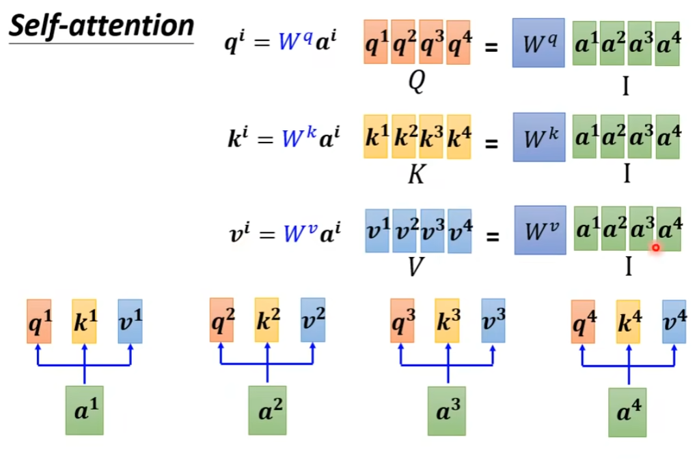
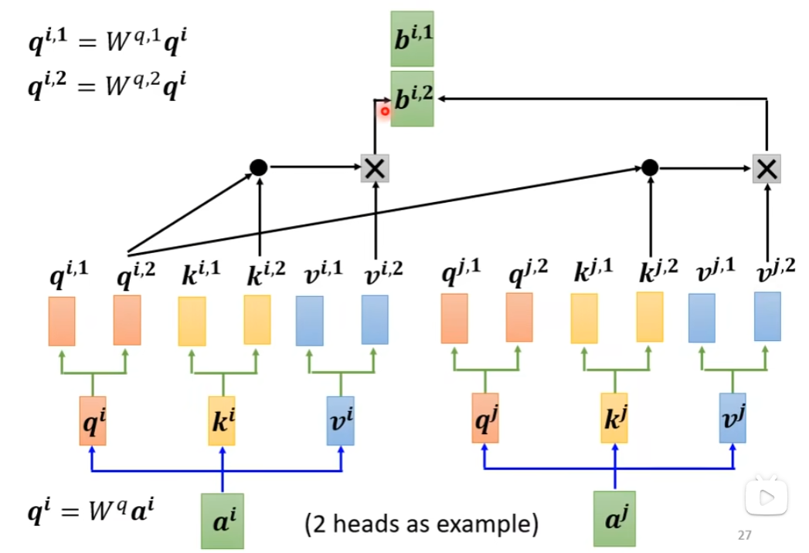
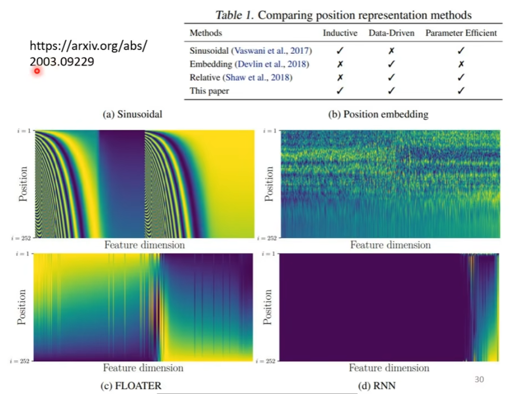
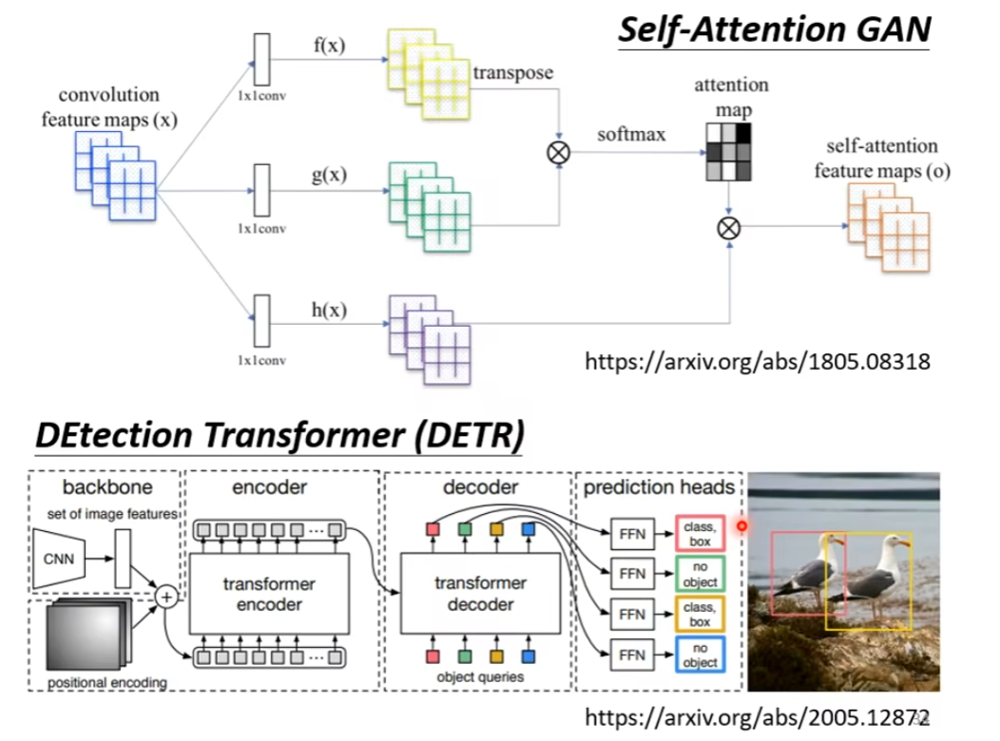

# Self-attention

讲完了CNN以后，还要讲另外一个常见的network架构，这个架构叫做Self-attention。

Self-attention想要解决的问题是什么呢？

他想要解决的问题是，到目前为止，我们的network的input都是一个向量（不管是在“预测YouTube观看人数问题”还是“影像处理问题”，我们的输入都可以看做是一个向量），而我们的输出可能是一个数值（这种是Regression），可能是一个类别（这种是Classification）。

——但假设我们遇到更复杂的问题呢？假设说，我们的输入是一排向量呢？而且这个输入的向量的数目是会改变的呢？而且，再回顾一个问题，我们在影像辨识任务中说到，我们需要假设输入的影像大小是一样的，那假设是不一样的呢？即，假设我们每次输入到Model中的sequence的数目、sequence的长度都不一样呢？这个时候应该怎么处理？

## 一、输入

有什么样的例子，它的输入是一个 sequence，而且长度是会改变的呢？

### （一）例子：文字处理

假设我们今天要network输入七个句子的话。那么，每个句子的长度肯定都不一样，每个句子里面词汇的数目、长度肯定都不一样。

如果我们把一个句子里面的每一个词汇都描述成一个向量，那我们Model的输入就会是一个vector set。而且这个vector set的大小每次都不一样（因为句子长度不一样）。

有人可能会问：怎么把一个词汇给表示成一个向量？

最简单的做法，是One-hot Encoding，如下所示。

你就开一个很长很长的向量，这个向量的长度跟世界上存在的词汇的数目是一样多的。假设英语总共有10万个词汇，这里就开一个10万维的向量，每一个维度对应到一个词汇。

——但是这样的表示方法有一个非常严重的问题：它假设所有的词汇彼此之间都是没有关系的。在这个向量中，你无法看到例如“cat和dog都是动物，它们比较接近”，“cat和apple一个动物一个植物，所以它们比较不接近”这样的资讯。即，这个向量里面没有任何语义的资讯。

---

有另外一个方法，叫做Word Embedding，如下图所示。

Word Embedding的意思是，我们会给每个词汇一个向量，而这个向量是有语义的资讯的。如果你把Word embedding画出来的话，你会发现，像上图那样，所有的动物可能聚集成一团，所有的植物可能聚集成一团，所有的动词可能聚集成一团，等等。——Word Embedding是怎么得到的呢？这个就不是今天要讲的重点了。

总之，你现在可以在网络上找到一种东西，叫做Word Embedding，它会给每一个词汇一个向量。而一个句子，就是一排长度不一的向量。

### （二）例子：声音处理

还有什么样的例子，我们需要把一个向量的sequence当做输入呢。

举例来说，一段声音讯号其实是一排向量。

我们会把一段声音讯号取一个范围，这个范围叫做一个window，把这个window里面的资讯描述成一个向量，这个向量就叫做一个frame。通常这个window的长度就是25ms（millisecond，毫秒）。

现在有一个问题：是怎么把这样一小段声音讯号变成一个frame，变成一个向量的呢？

这边就有很多很多种做法了，这里不细讲。

总之，有各种各样的做法，可以用一个向量来描述一小段、25ms里面的语音讯号。

之后，你为了要描述一整段的声音讯号，你会把这个window往右移一点。通常移动的大小是10个millisecond。

有人会问：为什么一段语音的长度是25ms，右移一次的大小却是10ms？——这个问题就很难回答，总之，已经有“古圣先贤”帮你调试好了，前人已经把所有的可能都试过了，然后挑一个最好的结果，就是这样的。

总之呢，一段声音讯号就是用一个向量来表示，而每一个window往右移一次都是移动10ms，所以，1s的声音讯号有几个向量呢？有100个。所以1分钟的声音讯号就有100×60=6000个向量。

所以，声音讯号也是一堆向量。

### （三）例子：Graph

还有什么东西是一堆向量呢？一个Graph。

一个图也是一堆向量。（是图结构，不是图片、图像）

我们知道，一个social network就是一个Graph，在social network上面每一个节点就是一个人，节点和节点之间的关系就是他们两个人的关系（比如是不是朋友，等等）。

而每一个节点可以看作是一个向量。 你可以拿每一个人的profile里的资讯（如性别、年龄，工作……）用一个向量来表示。

所以，一个social network，一个Graph，也可以看作是一堆的向量所组成的。

---

除了social network以外，还有什么例子也是Graph呢？

举例来说，一个分子，它也可以看作是一个Graph。

比如你要做一个drug discovery，这个时候，你就需要把一个分子当做是你模型的输入。而一个分子就可以看作是一个Graph，因为上面的每一个球就是一个原子，每个原子就是一个向量。

原子怎么用向量来表示呢？——你可以用One-hot vector来表示。

那么，一个分子，它就是一堆向量。

## 二、输出

我们刚才说输入是一堆向量，它可以是文字、语音、Graph……。那么输出是什么？我们在这种情况下，有可能有怎样的输出呢？——有三种可能性。

### （一）第一种可能性：Each vector has a label.

第一种可能性是，每一个向量都有一个对应的label。也就是说，当你的模型看到输入是四个向量的时候，他就要输出四个label。——而每一个label，它可能是一个数值（那就是个Regression的问题），它可能是一个class（那就是个Classification的问题）。

总之，在这种可能性里面，输入和输出的长度是一样的。所以模型不需要去烦恼，需要输出多少个label，多少个scalar。反正输入几个向量，就输出几个向量。

那，什么样的应用会用到这种可能性呢？

#### Example Applications

举例来说，在文字处理上，假设今天你要做的是POS tagging。POS tagging就是词性标注，你要让机器自动决定每一个词汇它是什么样的词性，是名词、动词、形容词……。

这个任务其实并没有很容易，如下图，

`I saw a saw.`对于第二个“saw”，它是作名词，意思是“锯子”。整句话的意思是“我看见了一个锯子”。所以，机器要知道，第一个saw是一个动词，而第二个saw，它虽然也是saw，但是它是一个名词。

总之，每一个词汇都要有一个对应的输出的词性，这个任务就是，输入和输出的长度是一样的。这个例子就属于“第一种可能性”类型的输出。

---

再举一个语音的例子。对于每一个vector，你都要决定它是哪一个音标。（当然，真正的语音辨识肯定不长这样。这里只是为了举例子而说的一个简化版）

---

或者说，如果是social network的话。就是给一个Graph，一个social network，那么你的Model要去决定每一个节点它有什么样的特性，比如说它会不会买某个商品，这样我们才知道说要不要推荐某一个商品给他。

总之，以上就是举“输入和输出向量数目一样”的例子。

### （二）第二种可能性：The whole sequence has a label.

第二种可能的输出是，一整个sequence只需要输出一个label就好。

#### Example Applications

举例来说，如果是文字的话，有一个叫“Sentiment analysis”，就是给机器看一段话，他会决定这句话是正面的还是负面的。——这个功能很有用，比如你的公司开发了一款产品，你想看看网友对这款产品的评价怎么样，但是你又不可能一条一条的去看网友的留言，那也许你就可以用这种Sentiment analysis的技术，让机器自动去判断，当贴文里面提到某个产品的时候，它的评价是正面的还是负面的。

如果是语音的例子。让机器听一段声音，然后判断是谁讲的。

如果是Graph的例子。给你一个分子，你想要预测这个分子有没有毒性，或者是它的亲水性如何。

### （三）第三种可能性：Model decides the number of labels itself.

第三种可能的输出是，我们不知道应该输出多少个label，机器要自己决定应该输出多少个label。

你输入可能是N个向量，他输出可能是$N'$个向量。

这种任务，又叫seq2seq的任务。 

举个例子，翻译，就是sequence to sequence的任务。因为输入输出是不同的语言，它们词汇的数目本来就不会一样多。

或者语音辨识，也是一个seq2seq的任务。输入一句话，然后输出一段文字。

## 三、Sequence Labeling

此处对应于上面的“第一种可能性：Each vector has a label.“的情况，它也叫做”Sequence Labeling“。要给sequence里面的每一个向量都给它一个label。

怎么做？直觉的想法就是，我们就拿着Fully Connected Network，虽然输入是一个sequence，但我们就各个击破，不要管它是不是一个sequence，我们只需要把每一个向量分别输入到Fully Connected Network里面，然后就会得到输出。接下来就要看你做的是Regression还是Classification，产生正确的对应的输出就结束了。 

但这样做，显然有非常大的瑕疵。

假设今天是词性标记的问题，你给机器一个句子“I saw a saw.”，对机器来说，这两个“saw”是完全一模一样的输入，既然Fully Connected Network输入同一个词汇，那它没有理由输出不同的东西啊。但实际上你期待第一个“saw”要输出“动词”，第二个“saw”要输出“名词”。但对Network来说，他不可能做到。

所以怎么办。有没有可能让Fully Connected Network考虑更多的，比如上下文context的资讯？这是有可能的。怎么做？你就把这几个向量前后几个都串起来，一起丢到Fully Connected Network，就结束了。

所以，我们每次不只是看一个frame，而是看前后若干个frame，从而再来决定这个frame是什么。

所以我们可以给Fully Connected Network一整个window的资讯，让它可以考虑一些上下文的、跟我现在要考虑的这个向量相邻的其他向量。

但是，如果今天有一个任务，不是我们只考虑一个window就能够解决的，而是必须考虑整个sequence才能解决，那要怎么办呢？

有人会说，这还不容易，我就把window弄大一点啊，大到可以把整个sequence盖住，不就行了吗？——但是不要忘了，今天sequence的长度是有长有短的，我们输入给Model的sequence的长度每次可能都不一样。——如果你真的要说，弄一个window把整个sequence都盖住，那你可能要统计一下你的训练资料，然后看看你的训练资料里面最长的sequence是多长，然后开一个window，比最长的sequence还要长，才能说把整个sequence都盖住了。

但是你开一个这么大的window，意味着你的Fully Connected Network，它需要非常多的参数。那可能不止运算量很大，可能还容易overfitting。

所以有没有更好的方法来考虑整个input sequence的资讯呢？——这就要用到我们接下来要跟大家介绍的Self-attention这个技术了。

### （一）Self-attention

Self-attention的运作方式就是，Self-attention会吃一整个sequence的资讯，然后你input几个vector，它就输出几个vector。

如上图，input了4个vector，它就输出4个vector。输出的这4个vector有什么特别之处呢？这4个vector，它们都是考虑一整个sequence以后才得到的。（具体Self-attention是如何考虑一整个sequence的，后面再说）

所以上图中，对于output的4个vector，我们给它加了一个黑色的边框，代表它不是一个普通的向量，而是考虑了整个句子以后才得到的资讯。——再把这个有考虑到整个句子的向量再拿来丢进Fully Connected Network，然后再来决定它应该output什么样的东西。

如此一来，这个Fully Connected Network就不是只考虑一个非常小的范围或一个小的window，而是考虑整个sequence的资讯，再来决定现在应该要输出什么样的结果。

上述就是Self-attention。

Self-attention不是只能用一次。你可以叠加很多次。你可以说，我这个Self-attention得到的“特殊向量”丢到Fully Connected Network里面输出，再把Fully Connected Network的输出再做一次Self-attention。即，再重新考虑Fully Connected Network得到的一整个sequence，并把它们再丢到另外一个Fully Connected Network当中。

总之，你可以把Fully Connected Network和Self-attention交替使用。就是，Self-attention负责处理整个sequence的资讯，而Fully Connected Network则专注于处理某一个位置的资讯。

有关Self-attention最知名的相关文章就是《Attention is all you need》。在这篇论文里，Google提出了Transformer这样的Network架构。在Transformer里面最重要的一个Module就是Self-attention。

那么，Self-attention内部到底是怎么运作的呢？

它的input就是一串的vector，这一串vector可能是你整个Network的input，它也可能是某个hidden layer的output。所以这里我们不用x来表示它，而用a来表示它，代表说它有可能是前面已经做过一些处理的。input一排a向量之后，Self-attention最终要output另一排b向量。对于这一排b向量，其中每一个b都是考虑了所有的a以后才生成出来的。

如图所画，$b^1$是考虑了$a^1到a^4$才生成的，$b^2,b^3,b^4$也一样。每一个都是考虑了整个input的sequence才产生出来的。

接下来，细说怎么产生$b^1$这个向量。（知道$b^1$是怎么产生的，其他的也就都知道了）

第一个步骤，是根据$a^1$找出这个sequence里面跟$a^1$相关的其他向量。

我们知道今天我们要做Self-attention，目的就是为了考虑整个sequence，但是我们又不希望把整个sequence都包在一个window里面，所以我们有一个特别的机制，这个机制是根据$a^1$这个向量，找出整个很长的sequence里面到底哪些部分是重要的、哪些部分是和判断$a^1$是哪一个label是有关系的、哪些部分是我们决定$a^1$的结果时所需要用到的资讯。

那，每一个向量跟$a^1$的关联的程度，我们用一个数值，叫$\alpha$来表示。

接下来的问题是，Self-attention module是怎么自动决定两个向量之间的关联性呢？比如它是怎么决定$a^1$跟$a^4$有多相关，还给出一个数值$\alpha$的？

在这里，你就需要一个计算attention的模组。这个模组就是拿两个向量作为输入，然后直接输出$\alpha$那个数值。

那怎么计算$\alpha$的数值呢？这里就有各种不同的做法。

一种比较常见的做法叫做Dot-product，它的做法是，你把输入的这两个向量分别乘上两个不同的矩阵，左边这个向量乘上$W^q$这个矩阵，右边这个向量乘上$W^k$这个矩阵，得到$q$和$k$这两个向量，再把$q$和$k$相乘，就得到一个数值，这个数值就是$\alpha$。

还有其他计算方式，比如一种Additive的计算方式。它的计算方法是，同样是这两个向量，通过$W^q$和$W^k$得到$q$和$k$，但是我们不是做点乘，而是把它俩相加，再过一个activate function，然后再通过一个transform，得到$\alpha$。

总之，有很多方法可以计算这个attention，可以计算这个$\alpha$的数值，可以计算这两个向量关联的程度。——但是在接下来的讲解里面，我们都只用Dot-product的方法，这也是今日最常用的方法，也是用在Transformer里面的方法。

总之，用两个向量，就可以计算它们之间的关联程度$\alpha$。

接下来，怎么把它套用在Self-attention里面呢？

我们要计算$a^1$和$a^2,a^3,a^4$之间的$\alpha$，那么，我们要让$a^1$乘上$W^q$，得到$q^1$。这里这个q我们叫做==query==。

那么，$a^2$要乘上$W^k$，得到$k^2$。这个k我们叫做==key==。

得到的这个$\alpha$，我们给它的下标记为$\alpha_{1,2}$，代表说“query是$a^1$提供的，key是$a^2$提供的”。

对于$\alpha$，也就是关联性，它也有一个名字，叫做==attention score==。

对于$a^3$和$a^4$同理，最终得到的结果如下图所示。

其实，在实际操作的时候，对于$a^1$，它也要计算一个自己的$k^1$，也就是它要计算自己跟自己的关联性。那自己跟自己的关联性有什么用呢？——这个问题你可以通过程序来看看，算不算的结果影响大不大了。

计算$a^1$跟每一个向量的关联性以后，接下来会做一个Soft-max。

计算公式如上图右上角所示。通过Soft-max，原本的一排$\alpha$就变成了一排$\alpha'$。

这里为什么要用softmax？有什么道理吗？——这里不用Soft-max其实也可以，你可以用别的东西。比如说有人尝试在这里做一个ReLU，结果发现比Soft-max还好一点。总之，这里你要用什么activation function都行，你可以试试看。只不过Soft-max是最常见的了。你也可以试试看能不能试出来比Soft-max更好的结果。

现在，根据这个$\alpha'$，我们已经知道哪些向量跟$a^1$是最有关系的，接下来我们要根据这个关联性，根据这个attention score来抽取重要的资讯。

怎么抽取重要的资讯呢？我们会把$a^1$到$a^4$，每一个向量乘上$W^v$，得到新的向量，分别用$v^1,v^2,v^3,v^4$来表示，然后，把向量$v^1,v^2,v^3,v^4$每一个都乘上attention score，即每一个都乘上$\alpha'$，然后再把它们加起来，最终得到$b^1$。

那你可以预料到，如果某一个向量他得到的分数越高，比如说$a^1$跟$a^2$的关联性很强，那我们得到的$b^1$的值可能就会比较接近$b^2$。

以上，我们就讲了怎么从一整个sequence得到$b^1$。其他b向量的计算方式同理。

这里要强调一点，这里计算得到的$b^1,b^2,b^3,b^4$并不是按照顺序产生，它们是一次同时被计算出来的。

再举一个$b^2$的计算过程，如下图所示。

### （二）从矩阵运算的角度来看Self-attention

我们之前已经讲了Self-attention是怎么运作的。

$a^1$到$a^4$，它们每一个a都要分别产生$q,k,v$。

我们每一个$a^i$都要乘上矩阵$W^q$，得到$q^i$。那么，多个$a$向量，其实可以合并起来，当成一整个矩阵来看待。——$a^1,a^2,a^3,a^4$拼起来的矩阵，我们用$I$来表示，我们得到的矩阵用$Q$来表示。

所以，我们$a^1$到$a^4$，得到$q^1$到$q^4$这件事情，这个操作，其实就是把一个矩阵$I$乘上一个矩阵$W^q$（说明，这个矩阵$W^q$是一些参数，它是要被learn出来的），得到矩阵$Q$。

对于$k$和$v$，也是一样，可以看作矩阵乘法。

总之，由$a$得到$q,k,v$，就是拿矩阵$I$分别乘上不同的矩阵，就能得到了。

下一步是什么，下一步就是每一个$q$会去跟每一个$k$计算内积，去得到attention score。——这件事情，如果从矩阵乘法的角度来看，是一件什么事情呢？

对于四个内积操作，即$q^1$分别和$k^1,k^2,k^3,k^4$相乘，我们其实也可以把它们拼起来，形成一个整体的矩阵运算，如上图右上角所示。

接下来，我们不只是计算$q^1$和其他的k相乘，我们还要计算$q^2,q^3,q^4$和其他的k相乘。

把所有的看作整体，就得到了以下矩阵乘法，如下图所示。

接下来一步，我们会对每个$\alpha$做一下normalization（效果就是，让每一列里面的值相加都是1），比如说会做一个softmax（我们之前也讲过，做softmax不是唯一的选项，你完全可以选择其他的操作），得到各个$\alpha'$。

再下面一步的操作是，我们把每个$v$和$\alpha'$相乘（下图中打错了，不是$\hat \alpha$，应该还是$\alpha'$），再相加，可以得到$b$。

这个计算过程，如果从矩阵的角度来看，则如下图所示。

我们再总结一下上面讲的。

矩阵$I$就是我们的input，是Self-attention的input。它是一排vector，这一排vector拼起来当做矩阵的列，就形成了矩阵$I$。

让这个input分别乘上三个矩阵，$W^q,W^k,W^v$，得到$Q,K,V$这三个矩阵。

接下来，$Q$乘上$K^T$，得到矩阵$A$；矩阵$A$做一些处理，得到$A'$（有些时候，我们会把这个$A'$叫做Attention Matrix）。

接下来，再把$A'$乘上$V$，就得到了$O$，$O$就是Self-attention这个Layer的输出。

所以，整体来看，Self-attention的输入是$I$，输出是$O$。

再次分析，我们发现，在Self-attention这个Layer里面，虽然有很多复杂的操作，但是实际上需要学习的参数只有$W^q,W^k,W^v$而已，只有它们是未知的，是需要透过我们的训练资料把它找出来的。

### （三）Multi-head Self-attention

Self-attention有一个进阶的版本，叫做Multi-head Self-attention。

Multi-head Self-attention在今天的使用其实是非常广泛的。

为什么我们需要“比较多的head”呢？

你可以想一下“相关”这件事情。在Self-attention中，我们是用$q$去找相关的$k$。但是“相关”这件事情，有很多种不同的形式，有很多种不同的定义，所以也许我们不能只有一个$q$，我们应该要有多个$q$，不同的$q$负责不同种类的相关性。

所以Multi-head应该怎么做？如下，你先把$a$乘上一个矩阵得到$q$，接下来，你再拿着$q$乘上另外两个矩阵，分别得到$q^1$和$q^2$。

在这个例子中，我们是有两个head，也就是我们认为这个问题里面有两种不同的相关性。

那既然q有两个，那k和v就也要有两个。

两个q，两个k，两个v都是怎么得到的？其实就是把原来的一个q，k，v再分别各自去乘上两个不同矩阵就得到了。

对于其他的向量$a$，也是一样的。

那接下来怎么做Self-attention呢？

$q^1$只需要去找所有的$k^1$，然后再与各自的$v^1$相乘，即可得到attention score。把全部的相加，即得到了$b^1$。如下图所示。

无论你有多少个head，无论你是有8个、16个head，也都是同样的操作。下图是两个head的情况下所做的操作。

拿到两个$b$，我们会把它俩拼起来，乘上一个矩阵，得到一个$b$，再把这一个$b$送到下一层去。

以上就是Multi-head Self-attention，一个Self-attention的变形。

### （四）Positional Encoding

讲到目前为止，你可能会发现一个问题，Self-attention的这个Layer它也许少了一个很重要的资讯，这个资讯是位置的资讯。

对于一个Self-attention的Layer而言，每一个input，它是出现在sequence的最前面，还是最后面？它是完全没有这个资讯的。——你可能会说，刚才不是看了那么多，每一个input都有标号1,2,3,4吗？但是那个标号是我们在图上画出来的，为了方便讲解而手动标上的编号。

你想想看，对于Self-attention而言，那个位置1，位置2，位置3，位置4上放的是什么，对他来说有什么差别吗？完全没有任何差别。这四个位置的操作其实也都是一模一样的。对他来说，$q^2$和$q^3$未必离得特别近，而$q^1$和$q^4$也未必隔得非常远。所有的位置之间的距离都是一样的，没有任何一个位置距离的比较远，也没有任何位置距离比较近。也没有谁在整个sequence的最前面，也没有谁在整个sequence的最后面。

但是这样设计，可能会有一些问题。因为有些时候，位置的资讯也许很重要啊。

举例来说，我们在做POS tagging，也就是词性标记的时候，也许我们知道说，动词比较不容易出现在句首。所以我们知道，如果某个词汇它是放在句首的，那它是动词的可能性就比较低。——会不会有这样的情况呢，也就是位置的资讯往往也是有用的？——可是，在我们目前所讲的Self-attention的操作里面，它根本就没有位置的资讯。

所以怎么办呢？如果你觉得在做Self-attention的时候，你觉得位置的资讯是一个很重要的事情，那你可以把位置的资讯给它塞进去。

怎么把位置的资讯塞进去呢？——这边就要用到一个叫做Positional Encoding的技术。

这个技术是这样的：你为每一个位置设定一个vector，叫做positional vector，每一个不同的位置就有一个不同的vector，$e^i$。此时这个$i$就表示位置。

然后把这个$e^i$加到$a^i$上面，就结束了。因为如果他看到$a^i$被加上了$e^i$，他就知道我现在出现的位置应该是在$i$这个位置了。

那，这个$e^i$长什么样子呢？

在《Attention is all you need》这篇论文里面，他用的$e^i$是长这个样子的。

在这张图上，每一个列都代表一个$e^i$，给每一个input加上一个对应的$e$，这样你的Model在处理的时候，它就可以知道现在这个input的位置的资讯是什么样子。

这样的positional vector，它是属于hand-crafted，也就是它是人设的。

那人设的vector会有很多问题啊。假设我现在定的这个vector，只定到128，那我现在sequence的长度如果是129怎么办呢？不过在《Attention is all you need》里面没有这个问题了，因为他的vector是透过某一个sin、cos的function所产生的。你可能又会有新的问题，为什么这个是由sin、cos的一些规则产生的呢，为什么不是别的东西呢，为什么要这样产生hand-crafted的positional vector呢？其实你也不一定要这么产生，这个positional encoding仍然是一个尚待研究的问题，你可以创造自己新的方法。

或者，positional encoding甚至是可以根据资料学出来的。即：learned from data。

有关positional encoding的问题，你可以再参考一下文献。

比如上面这篇论文，它是比较并提出了一个positional encoding。

总之，你有各种各样的方法生成positional encoding。但是目前我们也不知道哪种最好，这是一个尚待研究的问题，你永远可以提出新的做法。

### （五）Self-Attention用途广泛

Self-attention在nlp问题上的应用是大家都耳熟能详的。

但是Self-attention不是只能用在nlp相关的应用上，他还可以用在很多其他的问题上。

#### （1）语音上

比如说在做语音的时候，你也可以用Self-attention。

不过在做语音的时候，你用Self-attention，你可能会希望对Self-attention做一些小小的改动。举例来说，如果你把一个语音用一排向量表示的话，这排向量可能会非常的长（我们之前也说过，每隔10ms都要产生一个向量，所以1s的语音就会有100个向量了……）。

那向量非常多，会有什么问题？你想想看这个Self-attention大概的计算过程，它的复杂度，其实和矩阵的尺寸（Attention Metrix）相关了。矩阵的尺寸其实大概就是这一排向量长度的平方。如果这个尺寸很大的话，你需要很大的memory才能把这个矩阵存下来。

总之，如果你今天讲一句话，那这句话所产生的这个Attention Metrix可能会太大，大到你根本就不容易处理、不容易训练。

那么怎么办呢？

在做语音的时候，有一招叫做Truncated Self-attention。Truncate Self-attention做的事情就是，今天我们在做Self-attention的时候，不要看一整句话，我们就只看一个小的范围就好。至于这个范围有多大，那是人设定的。

那么为什么今天我们在做语音辨识的时候，只做一个小的范围就好？那就取决于你对这个问题的理解。——也许我们要辨识这句话的某一个位置有什么内容的时候，我们并不需要看整句话，我们只需要看这句话跟它前后一定范围之内的资讯，其实就可以判断了。

所以，在做Self-attention的时候，其实也许没有必要看过一整个句子，也许没有必要让Self-attention考虑一整个句子，也许只需要考虑一个小范围就好。这样就可以加快运算的速度。

#### （2）图像上

其实Self-attention还可以被用在影像上。

我们讲到现在，一直在说，Self-attention的适用范围，是当输入是一排向量，是一个vector set的时候。

我们之前在讲CNN的时候，我们是说，影像，一张图片，我们是把它看作一个很长的向量。

其实，一张图片，我们也可以换一个观点，把它看作是一个vector set。

怎么把一张图片看作是一个vector set呢？

如图，是一个解析度为5×10的图片。这张图片可以看成是一个Tensor，这个Tensor的大小是5×10×3。

那么你可以把每一个位置的pixel看作是一个三维的向量。每一个pixel是一个三维的向量，那么整张图片其实就是5×10个向量。

所以，我们换一个角度来看影像这个东西，它其实也是一个vector set。那既然也是一个vector set的话，你完全可以用Self-attention来处理一张图片。

---

那实际中有没有人用Self-attention来处理一张图片呢？是有的。

下面就举了两个例子以供参考。总之，现在把Self-attention用在影像处理上，也不是一个什么十分罕见的事情。

##### Self-attention v.s. CNN

那我们可以来比较一下Self-attention和CNN之间有什么样的差异或关联性。

如果我们今天是用Self-attention来处理一张图片。假设说图中红框部分是你要考虑的pixel，那么它应当产生query、其他pixel产生key。

你今天在做inner product的时候，你考虑的不是一个小的范围资讯，而是整张影像的资讯。

但是在做CNN的时候，它讲究的是一个Receptive Field，每一个Filter、每一个neuron，只考虑Receptive Field范围里面的资讯。

所以如果我们比较CNN和Self-attention的话。我们可以说，CNN可以看作是一种简化版的Self-attention，因为在做CNN的时候，我们只考虑Receptive Field里面的资讯；而在做Self-attention的时候，我们是考虑整张图片的资讯。

或者你可以反过来说，Self-attention是一个复杂化的CNN。我们之前讲CNN的时候说，Receptive Field的形状、大小，是人为设定的，有一些可能的设计。而现在对Self-attention而言，我们用attention去找出相关的pixel，就好像Receptive Field是自动被学出来的，network自己决定说Receptive Field的形状长什么样子，network自己决定说，以这个pixel为中心，哪些pixel是我们真正需要考虑的，哪些pixel是相关的。

其实你可以读一篇paper，叫《On the Relatioinship between Self-Attention and Convolutional Layers》，在这篇论文里面，它用了数学的严谨的方式告诉了你，其实CNN就是Self-attention的特例。Self-attention，只要设定合适的参数，它可以做到跟CNN一模一样的事情。

所以Self-attention是更灵活的CNN，而CNN是受限制的Self-attention。

那既然Self-attention可以看作是更flexible的CNN，那记不记得我们在讲overfitting的时候，我们说比较flexible的model，比较需要更多的data，如果data不够，就有可能overfitting；而小的model、比较有限制的model，它适合在data少的时候，可能比较不容易overfitting。

如果你今天用不同的data量来训练CNN跟Self-attention，你也确实可以看到刚才所说的现象。

上图是Google的一篇论文，看这个图表的横轴，10M表示1000万张图片的量，300M表示3亿张图片的量。浅蓝色的线代表Self-attention，深灰色的线代表CNN。

可以发现，随着资料量的增多，在资料量最多的时候，Self-attention可以超过CNN。但是在资料量少的时候，CNN是可以比Self-attention得到更好的结果的。——为什么会这样，你就可以从CNN和Self-attention的弹性方面来解释。

那你可能会问，CNN和Self-attention到底哪个好，我应该用哪个？你也可以都用。

#### （3）Self-attention v.s. RNN

#### （4）Graph上

## 四、Self-attention有多种不同的变形

Self-attention的一个最主要的问题是，它的运算量非常大。所以怎样减少Self-attention的运算量是一个未来的重点。

Self-attention最早是用在transformer上面，所以很多人讲transformer的时候，其实他指的就是Self-attention。有人说广义的transformer指的就是Self-attention。——所以，后来各式各样的Self-attention的变形也就都叫做“xxx-former”。

对于上图的右上角图表。横轴代表速度，纵轴代表performance。可以看到有些新的former的速度更快，但是速度更快带来的就是performance变差。

那么，到底怎样的Self-attention可以又快又好，这仍然是一个尚待研究的问题。