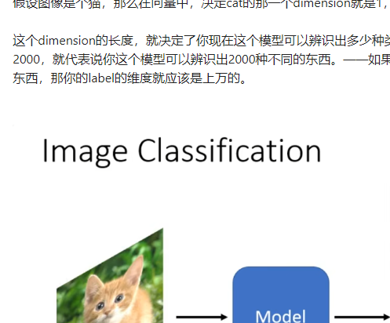

我们开始探讨network的架构设计。

第一个要讲的network的架构变形是Convolutional Neural Network（CNN）。它是专门被用在影像上的。

希望通过CNN的例子，来了解network的架构设计有什么想法，为什么设计network的架构可以让我们的network的结果做的更好。

## 一、Image Classification

现在想象说，我们要做影像的分类。

也就是给机器一张图片，它要去决定说这张图片里面有什么样的东西。

在以下的讨论里面，我们都假设我们的模型输入的图片大小是固定的。（实际上，在如今的影像辨识任务中，往往都需要有这样的假设）

模型的输入是一张图片，模型的输出是$\hat y$，是一个vector。

假设图像是个猫，那么在向量中，决定cat的那一个dimension就是1，其他的都是0。

这个dimension的长度，就决定了你现在这个模型可以辨识出多少种类的东西。比如你的向量长度是2000，就代表说你这个模型可以辨识出2000种不同的东西。——如果你想让你的模型能识别上万种东西，那你的label的维度就应该是上万的。

![[file-20241127175719763.png]]

模型实际的运行结果是一个$y'$，它和$\hat y$之间是有差距的（Cross entropy），这些都是之前讲过的理论。

---

接下来的问题是，怎么把一张影像当做一个模型的输入呢？

首先，对电脑来说，一张图片，其实是一个三维的Tensor（Tensor可以理解成矩阵）。——哪三维？高、宽、通道数。

> 什么叫通道（channels）？今天的图片，它的每一个像素都是由R、G、B三个颜色所组成的，三个channels就分别代表了R、G、B三种颜色。

接下来，我们就要把这个三维的Tensor给它拉直。把它拉直以后，就可以丢到一个network里面去了。

![[file-20241127175938233.png]]

要理解一件事情：到目前为止，我们的network所接收的输入，其实就是一个向量。——所以，只要我们能够把一张图片变成一个向量，我们就可以把它当做是network的输入。

怎么把这个三维的Tensor变成一个向量呢？——最直接的办法，这个三维的Tensor里面有多少个数字呢？有`100 * 100 * 3`个数字。所以一张图片是由`100 * 100 * 3`个数字所组成的，把这些数字统统拿出来排成一排，就是一个巨大的向量。——这个向量就可以作为network的输入。

这个向量里面某一维存放的一个具体的数值，其实就是某一个像素的某一个颜色的强度。

---

总之，这个向量，我们把它作为network的输入。

我们目前为止，只讲过了Fully Connected Network。我们把这个向量当做这个network的输入。

那么input这边的feature vector的长度就是`100 * 100 * 3`。

那么，假设我们第一层的neuron的数目有1000个。——那么，你能计算一下，从input层到第一层之间，总共有多少个weight吗？

每一个neuron，它和输入向量的每一个数值之间都会有一个weight。所以，如果有`100*100*3`个输入数值，有`1000`个neuron，那么就会有`1000 * 100 * 100 * 3`个weight。也就是$3*10^7$个，是一个非常巨大的数目。

![[file-20241127175955910.png]]

参数多，会有什么样的问题呢？

随着参数的增加，我们可以增加模型的弹性、能力……。但是，我们也增加了overfitting的风险。（从概念上来讲，模型的弹性越大，就越容易overfitting）

那么，我们在做影像辨识的时候，怎么避免使用这么多的参数呢？

考虑到影像辨识这件任务本身的特性，其实我们并不一定需要“Fully Connected”这件事。

考虑影像本身的特性，我们其实不需要每一个neuron跟input的每一个dimension都有一个weight。——怎么这样说呢？接下来，我们就对影像辨识这个问题，对影像本身的特性做一些观察。

### （一）Observation 1

第一个观察，是对影像辨识这个问题而言，假设我们想要知道“这张图片里面有一只动物”、“这个动物是一只鸟”，要怎么做呢？

也许对一个影像辨识的系统而言，对一个影像辨识的neuron，对一个影像辨识的类神经网络里面的神经元而言，它要做的就是侦测，侦测这张图片里面有没有出现一些特别重要的pattern，而这些pattern是代表了某种物件的。

![[file-20241127180039251.png]]

举例来说，如果现在有某个neuron说，他看到鸟嘴这个pattern；有某个neuron又说，他看到眼睛这个pattern；有某个neuron说，他看到鸟爪这个pattern……。也许，看到这些pattern，综合起来就代表说我们看到了一只鸟。——类神经网络就可以告诉你说，因为看到了这些pattern，所以他看到了一只鸟。

![[file-20241127180050318.png]]

也许你会觉得，看pattern，然后决定它是什么……这件事好像没有那么聪明。但仔细想想，人是不是也是用同样的方法来看一张图片中有没有一只鸟呢？

![[file-20241127180105435.png]]

就算是人，在判断一个图片是什么物件的时候，往往也是抓最主要的特征，在看到这些特征以后，很直觉地就说，你看到了某种物件。——那么，对机器来说，也许这也是一个有效地判断影像中有什么物件的方法。

---

但是，假设我们现在要让neuron做的事情，是判断说现在有没有某种pattern出现，那也许我们并不需要每一个neuron都去看一张完整的图片。——因为这些重要的pattern，比如说眼睛、鸟嘴、鸟爪……并不需要看整张完整的图片才能够得到这些资讯。——比如判断有没有鸟嘴，只需要把红框那一部分图片给一个neuron看一下就行了，而不需要把整张图片都让他看。

![[file-20241127180133617.png]]

所以，这些neuron也许根本就不需要把整张图片当做输入，他们只需要把图片的一小部分当做输入，就足以让他们侦测某些特别关键的pattern有没有出现。

上述是第一个观察。

### （二）Simplification 1

根据第一个观察，我们就可以做第一个简化。

怎么简化呢？本来我们每个neuron都要看完整的图片——把图片的每一个像素，以及每一个像素包含的三个通道，这些所有的资讯，都丢给一个neuron，最后让它产生output。——这是Fully Connected Network做的事情。

但是经过第一个观察，我们说，其实不需要让一个neuron看完整的图片，我们只需要让他看图片的一小部分就足够了。

那，怎么根据这个观察，来设计我们的neural network？

在CNN里面，有一个这样的做法：

我们会设计一个区域，叫做`receptive field`。每一个neuron都只关心自己的receptive field里面发生的事情就好了。

